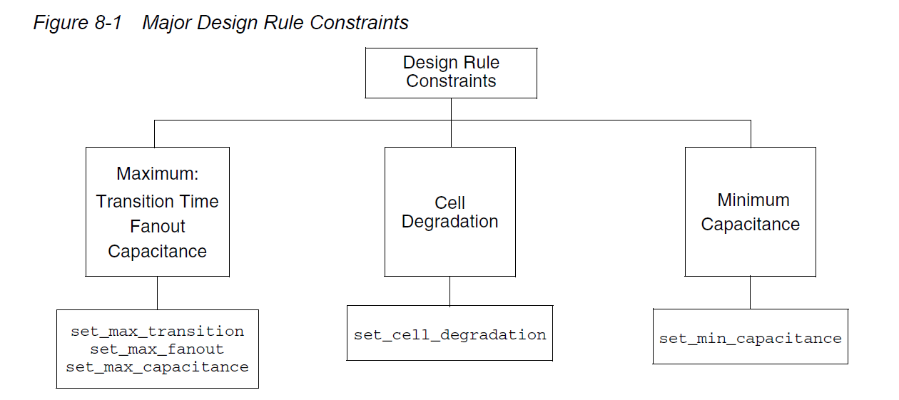

# lab3

## Constraint

| 要求 | my constraint | reference constraint | 说明 |
| --- | --- | --- | --- |
| 时钟频率333.33Mhz | create_clock -period 3 [get_ports clk] | create_clock -period 3.0 [get_ports clk] | create_clock -period vaule -name clock name [source object] -waveform {egde list} -add -comment “commet for this clock” -period vaule 为周期；-name clock name 表示时钟名字，缺省时表示时钟名字与源对象名字一致；源对象[source object]可以为端口、引脚、网络，虚拟时钟没有源对象；-waveform {egde list}指明占空比，egde list 中的数值表示一个周期之内第一个时钟上升沿到来的时刻和第一个时钟下降沿到来的时刻，缺省时表示占空比为 50%；-add 表示同源对象的时钟（例如源对象通过多路选择器）；-comment “commet for this clock”为注释。 |
| 外部时钟最大延时到clockport是700ps | set_input_delay 0.7 clk | set_clock_latency -source -max 0.7 [get_clocks clk] | 时钟延迟： -此处为片外时钟源到定义在端口的时钟源延迟，set_clock_latency -source -max (-min) value [get_clocks XX] |
| clock到寄存器的时钟引脚延时是300ps ± 30ps | set_max_delay 0.3 [get_clocks clk] ？ | set_clock_latency -max 0.3 [get_clocks clk] set_clock_uncertainty -setup 0.15 [get_clocks clk] | 说明： 1、时钟延迟 -此处为定义在端口的时钟到各个时序单元时钟端口的网络延迟，set_clock_latency -max (-min) value [get_clocks XX] 2、skew + jitter + margin = uncertainty，一共0.15ns的不确定 skew算成60ps |
| 时钟周期有±40ps的jitter | set_clock_uncertainty  0.04 [get_clocks clk] | set_clock_uncertainty -setup 0.15 [get_clocks clk] | 说明：skew + jitter + margin = uncertainty，一共0.15ns的不确定
skew算成60ps |
| clock有50ns的margin | set_clock_uncertainty -setup 0.05 [get_clocks clk] | set_clock_uncertainty -setup 0.15 [get_clocks clk] | 说明：skew + jitter + margin = uncertainty，一共0.15ns的不确定 skew算成60ps |
| rise/fall转换最长时间120ps | set_max_transition 0.12 [get_clocks clk] | set_clock_transition 0.12 [get_clocks clk] | 时钟过渡时间： set_clock_transition -rise value [get_clocks XX]表示上升过渡时间， set_clock_transition -fall value [get_clocks XX]表示下降过渡时间。 |
| 寄存器最大建立时间0.2ns | ? |  | 拿来算下面的输入输出延时了 |
| data1和data2输入的最大延时是2.2ns | set_input_delay -max 2.2 {data1 data2} | set_input_delay -max 0.45 -clock clk [get_ports data*] | 说明：输入靠寄存器捕获 计算输入的最大延时：端口input_delay+ clock uncertainty + 组合逻辑延时（from input port to reg) + reg setup = 1 period x + 0.3 ±0.15 + 2.2 + 0.2 = 3  x_max = 0.45 |
| F3 data到达sel端口的绝对时间是1.4ns | set_input_delay 1.4 {data1 data2} | set_input_delay -max 0.4 -clock clk [get_ports sel] | 说明： 输入端口延时+源时钟延时+网络时钟延时 = 最晚达到输入端口的绝对时间 x + 0.7 + 0.3 = 1.4 → x = 0.4 |
| The maximum delay of the external combo logic at port out1 is 420ps; F6 has a setup time of 80ps | set_output_delay -max 2.5 out1 | set_output_delay -max 0.5 -clock clk [get_ports out1] | 说明： 输出的最大延时 = combo logic delay + setup x = 0.42 + 0.08 = 0.5 |
| out2内部最大延时是810ps | set_max_delay 0.81 out2 | set_output_delay -max 2.04 -clock clk [get_ports out2] | 说明： 输出端口延时+内部延时+内部建立时间不确定度(发送时间不确定度)=外部时序元件捕获时刻。 x + 0.81 + 0.15 = 3 |
| The out3 port has a 400ps setup time requirement with respect to its capturing register clock pin. | ？ | set_output_delay -max 0.4 -clock clk [get_ports out3] | 说明： out3的时序元件需要400ps捕获 |
| The maximum delay from Cin1 and Cin2 to Cout is 2.45ns. | set_max_delay 2.45 from {Cin1 Cin2} to Cout | set_input_delay -max 0.3 -clock clk [get_ports Cin*] set_output_delay -max 0.1 -clock clk [get_ports Cout] | 说明： 内部组合逻辑的输入端口延时+内部组合逻辑的延时+内部不确定度+内部组合逻辑的输出端口延时=1 period 2.45 + 0.15 + input_delay + output_delay = 3 → input_delay + output_delay = 0.4 input_delay:    0     0.1  0.2… output_delay:  0.4  0.3  0.2…(可以任意组合） |

Schematic

- 打开参考的constraint：
    
    > ls -a
    cd .solution
    vim MY_DESIGN.con
    > 

遇到的问题：

dcprocheck命令提示unknown？
不在dc_shell里运行dcprocheck而是在terminal里lab3的路径下运行