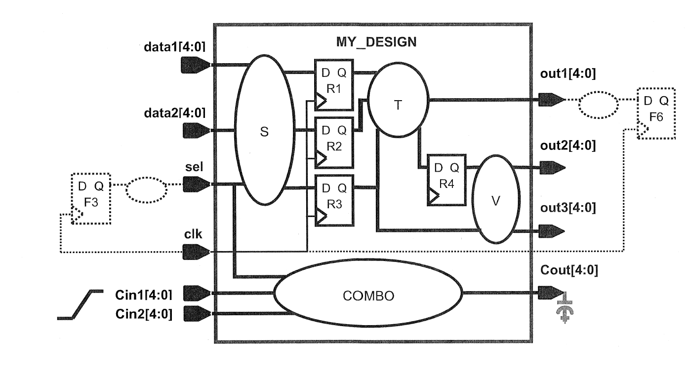

# lab4

Schematic

要求：

| 要求 | my constraint | reference constriant | 说明 |
| --- | --- | --- | --- |
| input1 | set_driving_cell -lib_cell bufbd1 -pin O [get_ports data*] set_driving_cell -lib_cell bufbd1 -pin O [get_ports sel] | set_driving_cell -lib_cell bufbd1 [remove_from_collection [all_inputs] [get_ports “clk Cin*”]] | 一般情况下的指令格式如下：set_driving_cell -lib_cell lib cell name -from_pin from pin name -clock clock name [get_ports XXX] lib_cell 为驱动单元名称，-from_pin 为多输出的驱动单元的区分，-clock 为时钟关联， get_ports 为指定驱动强度的端口名称 |
| input2 | set_max_transaction 0.12 [get_ports Cin*] | set_input_transition 0.12 [get_ports Cin*] |  |
| output1 | set_load -max {expr 2*[load of lib/bufbd7/I]} [get_ports out*] | set_load [expr 2 * {[load_of cb13fs120_tsmc_max/bufbd7/I]}] [get_ports out*] | lib要改成库的名字！！ |
| output2 | set_load -max 25 [get_ports Cout] | set_load 0.025 [get_ports Cout*] | 注意单位 |