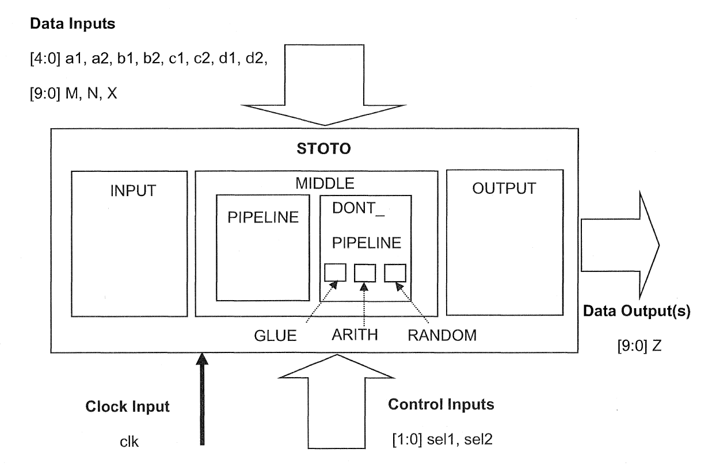

# lab5

General:STOTO是一个有两百多行的模块

my tcl

> set_svf STOTO.svf
read_file -format verilog {/home/asic_22215597/dc_lab/DC1_2012.06_part1/DC1_2012.06/lab5/rtl/STOTO.v}
current_design STOTO
link
source STOTO.con
*#查看设计的时序是否收敛，即设计能否满足时序的要求，这里还没综合所以应该是check*
report_timing
source STOTO.pcon
*#报告当前设计中的路径分组情况*
report_path_group
> 
> 
> report_port -verbose
> 
> set_ungroup INPUT false
> 
> set_optimize_registers true -design PIPELINE -clock clk -delay_threshold 2.1
> 
> set_dont_retime [get_cells PIPELINE/POUT] true
> 
> report_constraint -all_violators
> 

reference tcl

> set_svf STOTO.svf
read_verilog STOTO.v
> 
> 
> current_design STOTO
> 
> link
> check_design
> 
> source STOTO.con
> *#检查时序约束是否完整，综合前check，综合后report*
> check_timing
> 
> source STOTO.pcon
> *#自定义路径组且 clk 路径组的权重为最高(5)*
> 
> group_path -name clk -critical 0.21 -weight 5
> group_path -name INPUTS -from [all_inputs]
> group_path -name OUTPUTS -to [all_output]
> group_path -name COMBO -from [all_inputs] -to [all_output]
> 
> *###############################################*
> 
> set_ungroup [get_designs "INPUT"] false
> 
> set_dont_retime [get_cells I_MIDDLE/I_DONT_PIPELINE] true
> 
> set_optimize_registers true -design PIPELINE
> 
> set_dont_retime [get_cells I_MIDDLE/I_PIPELINE/z_reg*] true
> 
> write -f ddc -hier -out unmapped/STOTO.ddc
> 
> set_host_options -max_cores 4
> 
> compile_ultra  -scan  -timing -retime
> 
> report_hierarchy -noleaf
> 
> redirect -tee -file rc_compile_ultra.rpt {report_constraint -all}
> redirect -tee -file rt_compile_ultra.rpt {report_timing}
> 
> write -f ddc -hier -out mapped/STOTO.ddc
> 
> set_svf -off
> 
> get_cells -hier r_REG*_S*
> 
> report_cell -nosplit I_MIDDLE/I_PIPELINE
> #验证z_reg是否被移动，出现值证明没被移动
> 
> get_cells -hier *z_reg*
> 
> report_timing -from I_MIDDLE/I_PIPELINE/z_reg*/*
> 
> get_cells -hier R_*
> 
> report_cell -nosplit I_IN
> 
> get_cells  I_IN/*_reg*
> 
> exit
> 

## 自定义路径组（**(divide-and-conquer的策略）**

- 命令
    
    ***group_path -name INPUTS  -from [all_inputs]***
    
    ***group_path -name OUTPUTS -to [all_outputs]***
    
    ***group_path -name COMBO -from [all_inputs] -to [all_outputs]***
    
- 上面的命令产生**三个自定义**的路径组，加上原有的路径组，即寄存器到寄存器的路径组（因为**受CLK**控制，默认的是CLK的路径组），现在有4个路径组。组合电路的路径，属于“**COMBO**”组，由于该**路径组的起点是输入端**，在执行“**group_path -name INPUTS -from [all_inputs]**”命令后,命令中用了选项“**-from  [all_inputs]**"，它们原先属于“**INPUTS**”组。在执行“**group_path -name OUTPUTS -to [all_outputs]**”命令后，组合电路的路径**不会被移到**“**OUTPUTS**”组，因为**开关选项‘'-from”的优先级高于选项”-to”**，因此组合电路的路径还是留在“INPUTS”路径组。但是由于“**group_path -name COMBO -from [all_inputs] -to [all-outputs]**”命令中**同时**使用了开关选项“-from”和“-to" ,组合电路路径的起点和终点同时满足要求，因此它们最终归属于“**COMBO**”组。DC以这种方式工作来防止由于命令次序的改变而使结果不同。我们可以**report_path_group**命令来得到设计中**时序路径组**的情况。
- 指定权重进行优化，当某些路径时序较差时，可以通过指定权重，着重优化该路径
    
    *group_path -name clk -critical 0.21 -weight 5*
    

## Problem

1. source STOTO.pcon出错
    
    
    
    要在dc_shell -topo模式下打开
    
2. report_path_group只有一组，怎么生成的四组？
    
    自定义生成的
    
    
    

## Design Specification

| specification | my constraint | reference | 说明 |
| --- | --- | --- | --- |
| the I/O constraints are estimates and have been conservatively constrained | report_port -verbose |  |  |
| The final compiled design should meet setup timing on all internal register-to-register paths | ？ | set_cost_priority -delay |  |
| The **INPUT** block hierarchy should be preserved to facilitate post-synthesis verification | set_ungroup INPUT false | set_ungroup [get_designs “INPUT”] false | 防止特定的子模块被 ungrouped:
set_ungroup  <top_level_and/or_pipeiined_blocks>  false |
| The **PIPELINE** block contains a "pure" pipelined design | set_optimize_registers true -design PIPELINE -clock clk -delay_threshold 2.1 | set_optimize_registers true -design PIPELINE | 如果设计中包含有纯的流水线设计，那么可以进行寄存器retiming:
　　　　set_optimize_registers  true  -design  My_Pipeline_Subdesign -clock CLK1 -delay_threshold <clock_period> |
| The output (**POUT**) of **PIPELINE** must remain registered | set_dont_retime [get_cells PIPELINE/POUT] true | set_dont_retime [get_cells I_MIDDLE/I_PIPELINE/z_reg*] true | 如果有要求保持流水线中的寄存器器输出，就要进行约束：
set_dont_retime [get_cells  U_Pipeline/R12_reg*]  true |
| The positions of non-pipelined registers in the **I_DONT__PIPELINE** block are fixed and cannot be modified | ？ | set_dont_retime [get_cells I_MIDDLE/I_DONT_PIPELINE] true | 从适应性重新定时中排除特定的单元/设计(-retime)(也就是放在某些模块或者设计的寄存器被retime移动): set_dont_retime  <cells_or_designs>  true |
| The logic positions of registers may be modified unless expressly prohibited by above specs | ？ |  |  |
| The design is timing-critical |  | set_cost_priority -delay | 设置综合中时序优先 |
| Design rule constraints must not cause timing violations | report_constraint -all_violators |  |  |
| Scan insertion will be performed by the Test group after the design has met these specifications | ？ | compile_ultra  -scan  -timing -retime | 检查约束是否设置成功 |

## Check Constraints

1. report_path_group
    
    
    
2. get_attribute [get_designs “PIPELINE”] optimize_registers
    
    
    
3. get_attribute [get_designs “INPUT”] ungroup
    
    
    
4. get_attribute [get_cells I_MIDDLE/I_PIPELINE/z_reg*] dont_retime
    
    
    
5. get_attribute [get_cells I_MIDDLE/I_DONT_PIPELINE] dont_retime
    
    
    
6. get_attribute [get_designs “STOTO”] cost_priority(查看综合中是否是设置建立时间冲突的优先级高于 DRC 冲突)
    
    
    
    
    

## Compile

### compile_ultra命令

- syntax
    
    
    
    -incremental : 使用增量编译，DC只做门级优化，不会回到GTECH
    
    -scan : 做可测试(DFT)编辑
    
    -exact_map
    
    -no_autoungroup : 关掉自动取消划分特性
    
    -no_seq_output_inversion
    
    -no_boundary_optimization ：不作边界优化
    
    -no_design_rule | -only_design_rule
    
    -timing_high_effort_script | -area_high_effort_script ：时序优化 | 面积优化
    
    -top
    
    -retime ： 当有一个路径不满足，而相邻的路径满足要求时，DC会**进行路径间的逻辑迁移**，以同时满足两条路径的要求。（为了让某些寄存器不要被DC更改，通过命令set_dont_retime)
    
    -gate_clock
    
    -self_gating
    
    -check_only
    
    -congestion
    
    -spg
    
    -no_auto_layer_optimization
    
    **-**no_uniquify : 加速含多次例化模块的设计的运行时间
    
- 在**DC Ultra（或者DC的拓扑模式下）**中，我们可以用**Behavioral ReTiming(简称BRT)技术**，对**门级网表的时序**进行优化，也可以对**寄存器的面积**进行优化。BRT通过对门级网表进行**管道传递(pipeline)（或者称之为流水线）**，使设计的传输量(throughput)更快。BRT有两个命令:
    
    ***optimize_registers*** ：适用于**包含寄存器**的门级网表（不是compile_ultra的开关选项）。
    
    e.g: 将后级组合逻辑延时长的路径移到前级，满足时序要求
    
    
    
    ***pipeline_design*** ：适用于**纯组合电路**的门级网表。
    
- 使用**compile_ultra**命令时，如使用下面变量的设置，所有的**DesignWare层次**自动地被取消：
    
    **set  compile_ultra_ungroup_dw  true** (默认值为true)
    
- 使用compile_ultra命令时，使用下面的变量设置，如果设计中有一些模块的规模小于或等于变量的值，模块层次被自动取消：
    
    **set  compile_auto_ungroup_delay_num_cells**   **100**(默认值=500)
    
- 为了使设计的结果最优化，我们建议将**compile_ultra命令和DesignWare library一起使用**

此外，

1. 查看各个路径组分别的时序报告：redirect -tee -file rt_compile_ultra.rpt {report_timing}
    1. clk group
        
        
        
        slack是0，证明时序
        
    2. COMBO group
        
        
        
    3. INPUTS group
        
        
        
        INPUTS时序违例了
        
    4. OUTPUTS group
        
        ？
        
2. 查看子模块PIPELINE进行optimize_registers之后被移动的寄存器
    
    
    
3. 查看是否有被打散的模块
    
    
    
4. 查看寄存器是否被移动（返回值证明没有移动，反之证明已被移动）
    
    
    
5. 打开gui界面
    1. 在左上角设置了一个placement blockage
        
        
        
    2. cells界面打开标准单元
        
        
        
        可以看到标准单元之间有overlap，因为DC-Topo使用“coarse placement” algorithm for quicker placement, Coarse placement is good enough for purposes of estimating the interconnect or net parasitic R/C’s.