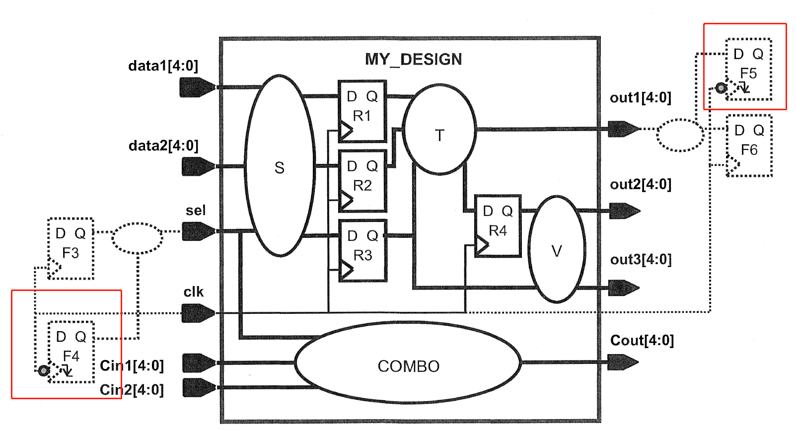

# lab7

## General

- 同时具有上升沿触发和下降沿触发寄存器的设计
- 输入/输出被不同的路径驱动/捕捉
- 外部输入/输出路径具有非默认延迟
- 输入驱动器扇出至其他外部负载

## Schematic

注意红色框的是下降沿触发的寄存器

要先copy lab4的constraints到lab7，然后修改constraints

## 设计要求

时钟

1. 名字从clk改成my_clk
2. 占空比40%高电平，0偏移
    
    
    | my | reference | 说明 |
    | --- | --- | --- |
    | create_clock -period 3.0 -name my_clk -waveform [0 1.2][get_ports clk] | create_clock -period 3.0 -name my_clk -waveform {0 1.2} [get_ports clk] | create_clock -period vaule -name clock name [source object] -waveform {egde list} -add -comment “commet for this clock” -period vaule 为周期； -name clock name 表示时钟名字，缺省时表示时钟名字与源对象名字一致；源对象[source object]可以为端口、引脚、网络，虚拟时钟没有源对象； -waveform {egde list}指明占空比，egde list中的数值表示一个周期之内第一个时钟上升沿到来的时刻和第一个时钟下降沿到来的时刻，缺省时表示占空比为 50%； -add 表示同源对象的时钟（例如源对象通过多路选择器）； -comment “commet for this clock”为注释。 |
    

输入

1. sel输入到达不晚于F4下降沿触发的420ps后
2. F4 处的时钟信号从其时钟源获得的总插入延迟为 600ps（外部 +内部）
    
    
    | my | reference | 说明 |
    | --- | --- | --- |
    | set_input_delay -max 1.02 -clock clk [get_ports sel] | set_input_delay -max 1.02 -clock my_clk -add_delay -clock_fall -network_latency_included -source_latency_included [get_ports sel] | set_input_delay [-reference_pin] [-clock clock_name] [-clock_fall] [-level_sensitive] [-network_latency_included]  [-source_latency_included][-rise] [-fall] [-max] [-min] [-add_delay] port_pin_list   -clock_fall指示delay与时钟下降沿相关， -network_latency_included指示时钟网络延时不附加到输入延时上， -source_latency_included指示时钟源延时不附加到输入延时上，-add_delay指示这是附加的约束条件 |

输出

1. out1被F5捕捉，信号必须在F5下降沿触发前260ps前到达
2. F5处的时钟信号在外部my_clk延迟后有500ps的内部延迟
    
    
    | my | reference | 说明 |
    | --- | --- | --- |
    | set_output_delay -max 1.46 -clock clk [get_ports out1] | set_output_delay -max -0.24 -clock my_clk -add_delay -clock_fall -network_latency_included [get_ports out1] | f5下降沿触发-500ps（-表示推后），信号要在下降沿触发前260ps到达，-500ps + 260ps = -0.24ns |

输入的外部负载

1. 除了clk之外的输入端口扇出到另外 2 个子块，每个子块在内部驱动相当于 3 个 bufbd1（输入引脚 I）缓冲器的模块。
    
    
    | my | reference | 说明 |
    | --- | --- | --- |
    | set_driving_cell -lib_cell [expr {3 * [load_of  cb13fs120_tsmc_max/bufbd7/I]} ][remove_from_collection [all_inputs] [get_ports “clk”]] | set all_in_ex_clk [remove_from_collection [all_inputs] [get_ports clk]]  set_load [expr 6 * {[load_of cb13fs120_tsmc_max/bufbd1/I]}] $all_in_ex_clk123 | 1、设置包括clk之外的输入的collection变量   2、每个输入扇出到另外两个子模块，每个子模块内部驱动相当于3个bufbd1，所以就是六倍 |
2. 除了clk之外的输入端口扇出到另外 2 个子块，每个子块在内部驱动相当于 3 个 bufbd1（输入引脚 I）缓冲器的模块。
    
    
    | my | reference | 说明 |
    | --- | --- | --- |
    | set_driving_cell -lib_cell [expr {3 * [load_of  cb13fs120_tsmc_max/bufbd7/I]} ][remove_from_collection [all_inputs] [get_ports “clk”]] | set all_in_ex_clk [remove_from_collection [all_inputs] [get_ports clk]] set_load [expr 6 * {[load_of cb13fs120_tsmc_max/bufbd1/I]}] $all_in_ex_clk123 | 1、设置包括clk之外的输入的collection变量 2、每个输入扇出到另外两个子模块，每个子模块内部驱动相当于3个bufbd1，所以就是六倍 |

## Check Constraint

dcprocheck MY_DESIGN.con

## Compile

## Report

也可以使用重定位的命令（将后面{}中命令的执行结果保存到文件中）：

### #Get report file

redirect -tee -file ${REPORT_PATH}/check_design.txt {check_design };

redirect -tee -file ${REPORT_PATH}/check_timing.txt {check_timing };

redirect -tee -file ${REPORT_PATH}/report_constraint.txt {report_constraint -all_violators};

redirect -tee -file ${REPORT_PATH}/check_setup.txt {report_timing -delay_type max };

redirect -tee -file ${REPORT_PATH}/check_hold.txt {report_timing -delay_type min };

redirect -tee -file ${REPORT_PATH}/report_area.txt {report_area };

1. report_timing
    
    
    
2. report_area
    
    
    

## Write .ddc

DC一般完成综合后，主要生成.ddc、.def、.v和.sdc格式的文件

**必须在生成ddc网表文件之前生成.def（也就先生成.def文件），以便将def文件包含在ddc文件中。**

| .sdc | 标准延时约束文件 | write_sdc my_constraints.sdc |
| --- | --- | --- |
| .def | DFT、形式验证可能用到，包含的是一些扫描链的布局信息 |  |
| .sdf | 标准延时格式文件 |  |
| .v | 网表格式文件 | write -f verilog -hierarchy -output my_verilog.v |
| .ddc | 保留综合结果的ddc文件(之后可以直接load这个文件，查看综合结果) | write -f ddc -hierarchy -output my_ddc.ddc |