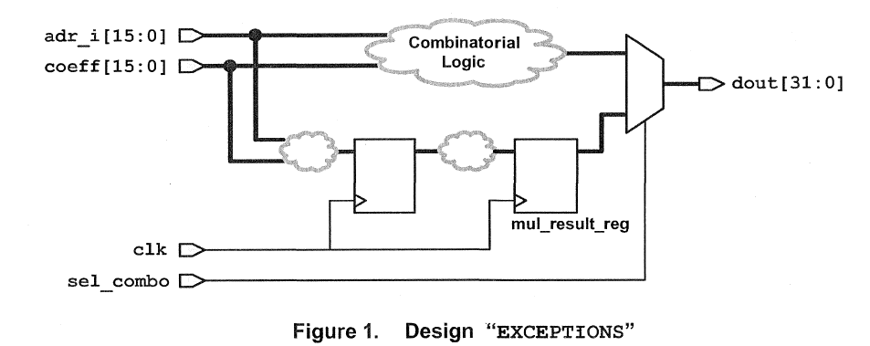

# lab8

General：综合有多时钟的路径

其中EXCEPTIONS这个设计已经综合成为了ddc文件

## Problem

使用report_timing和report_constraint命令

## View Report

设计有严重的时序违例

setup和critical_range违例

## Re-constrain

Key:

- 添加额外的约束使得组合逻辑与时序逻辑约束独立
- 使用虚拟时钟vclk去约束组合逻辑

### 约束组合逻辑

clk为5ns，input delay为2ns，output delay为4ns

因此，

1. 组合逻辑的延时必须不大于6ns，创建一个周期为6ns的虚拟时钟
2. 设置虚拟时钟的输入/输出延时都为0ns

命令：

> *create_clock -name vclk -period 6*
> 
> 
> *set in_ports [get_ports "coeff adr_i"]***
> 
> *set_input_delay  0 -clock vclk -add_delay $in_ports*
> 
> *set_output_delay 0 -clock vclk -add_delay [all_outputs]*
> 

约束完查看vclk时钟group的时序报告，可以看到仍然存在违例

由于这个mux的存在让这两条时钟路径有重叠，所以必须设置虚假路径

> *set_clock_group -name false_grp1 -logically_exclusive -group clk -group vclk
#使DC不对不同group的时钟做时序分析
set_false_path -from [get_clocks clk] -through $in_ports -through [all_outputs] -to [get_clocks clk]
#禁止clk对组合逻辑的输入到输出进行时序分析
#约束使用了两个“through”选项，把clk到clk的组合路径，从clk到clk的时序路径中分离出来
report_timing -from $in_ports -to [all_outputs]
#查看是否还有时序违例*
> 

**对于异步时钟通常会用set_clock_group/set_false_path/set_disable_timing做时序约束，不对跨异步时钟做时序分析**

- set_clock_group命令使得DC不会对不同group的时钟做时序分析（双向）
- set_false_path命令使DC不对timing path做分析（单向）
    - point2point
        
        set_false_path -from [get_pins xx] -to [get_pins xx]
        
- set_disable_timing命令对经过某个点的path都设置为false path
    
    set_disable_timing [get_pins pin_name]
    

约束后没有时序违例

### 约束时序逻辑

检查时序逻辑（clk）的timing report，发现是违规的

再次检查原理图，可以看到mul_result_reg是多周期路径(在发出和捕获的寄存器之间有多个寄存器）

> *set_multicycle_path 2 -setup -to mul_result_reg*/D
report_timing -to mul_result_reg*/D*
> 
- set_multicyle_path
    
    set_multicyle_path path_multiplier [-setup|-hold] [-start|-end] [-from from_list] [-through through_list] [-to to_list]
    
    -path_multiplier : 默认值setup时为1，hold时为0
    -setup|-hold : 表明多周期路径设置是对setup（max_delay）或者是hold（min_delay），setup时默认移动capture_clk，hold时默认移动launch_clk
    -start : 表示强制移动的为start clock即launch clock
    
    -end : 表示强制移动的为end clock即capture clock
    

约束后满足时序要求

