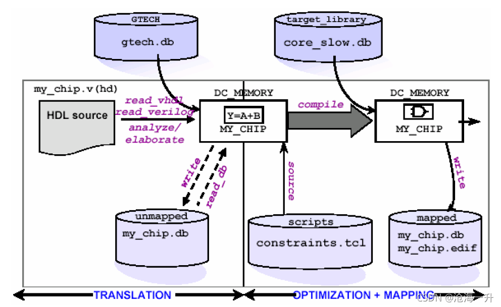

# DC User Guide

**Libraries & HDL Code & Constraints** 

**synthesis = translation + logic optimization + gate mapping** 

### Constraints

Constraints are declarations that define the design’s goals in measurable circuit characteristics, such as timing, area, power, and capacitance.

### Organize Design Data

# Synthesis Flow

Follow this flow:

#### [Prepare for synthesis](https://github.com/Delta9799074/MyNotes/blob/master/DC/notes/Prepare%20for%20synthesis.md)

#### [Specify Libraries](https://github.com/Delta9799074/MyNotes/blob/master/DC/notes/specify_libraries/Specify%20Libraries.md)

#### [Read Design](https://github.com/Delta9799074/MyNotes/blob/master/DC/notes/read_design/Read%20Design.md)