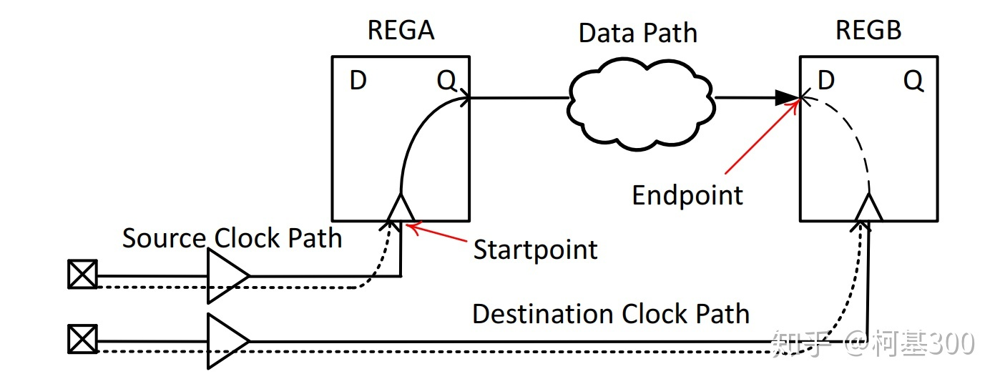

# Knowledge

# 时序路径

1. 每条时序路径有一个起点（**startpoint**）和一个终点（**endpoint**）。任何一条时序路径都是由下面的三条路径构成的。
    
    
    
    - 源时钟路径（Source Clock Path）
    - 数据路径（Data Path）
    - 目标时钟路径 （Destination Clock Path）
    
    起点是设计中数据由时钟边沿触发的位置，由source clock发起的数据启动时钟边沿为**launch edge**。 数据通过时序路径中的组合逻辑传播，然后被另一个时钟边沿在终点捕获，由destination clock产生的捕获数据时钟沿为**capture edge**。
    
2. 分组
    
    
    
    
    根据起点和终点的不同分为4种时序路径：
    
    - **输入端到触发器(Pad to Setup)**：Path 1，从输入端口开始，到达时序元件的数据输入。
    - **触发器到触发器(Clock to Setup)**：Path 2，**从时序元件的时钟引脚开始**，到时序元件的数据输入。
    - **触发器到输出端(Clock to Pad)**：Path 3，从时序元件的时钟引脚开始，到输出端口结束。
    - **输入端到输出端(Pad to Pad)**：Path 4，从输入端口开始，到输出端口结束。
3. 时序分析**（Setup and Hold Analysis)**
    
    **重要的参数：Slack，当Setup & Hold Slack为正值时，说明满足时序要求**
    
    ---
    
    Setup Time & Hold Time
    
    建立时间：触发器在时钟上升沿到来之前，其数据输入端的数据必须保持不变的最小时间。
    
    保持时间：触发器在时钟上升沿到来之后，其数据输入端的数据必须保持不变的最小时间。
    
    ---
    
    1. Setup Check
        
        **Setup Slack = Data Required Time(Setup) - Data Arrival Time**
        
        $Data Arrival Time = T_{launch} + T_{Clk2Q} + T_{DataPath}$，即数据到达输入端口的时间。
        
        $DataRequiredTime = T_{capture} + T_{clkperiod} - T_{setup}$
        
        
        
    2. Hold Check
        
        **Hold Slack = Data Arrival Time - Data Required Time(Hold)**
        
        
        
        **Data Arrival Time不变，要满足保持时间，**
        
        $DataRequiredTime = T_{capture} + T_{hold}$
        
4. DC report timing
    
    默认report_timing报告每一条路径组中的最长路径，报告分为四部分
    
    
    
    1. 基本信息：路径起点（StartPoint）、路径终点（EndPoint）、属于的路径组（PathGroup）、检查方式（Path Type，max指建立时间检查，min指保持时间检查）
    2. 各单元延时情况（计算Data Arrival Time）：节点名称（Point）、节点延时（Incr）、路径总延时（Path，r/f指示上升沿/下降沿）
    3. 路径要求的延时（计算Data Required Time，通过施加的时序约束确定的）
    4. 时序报告的结论：计算Slack，如果为正值则证明满足时序要求。
    
    # 时钟约束
    
    虚拟时钟