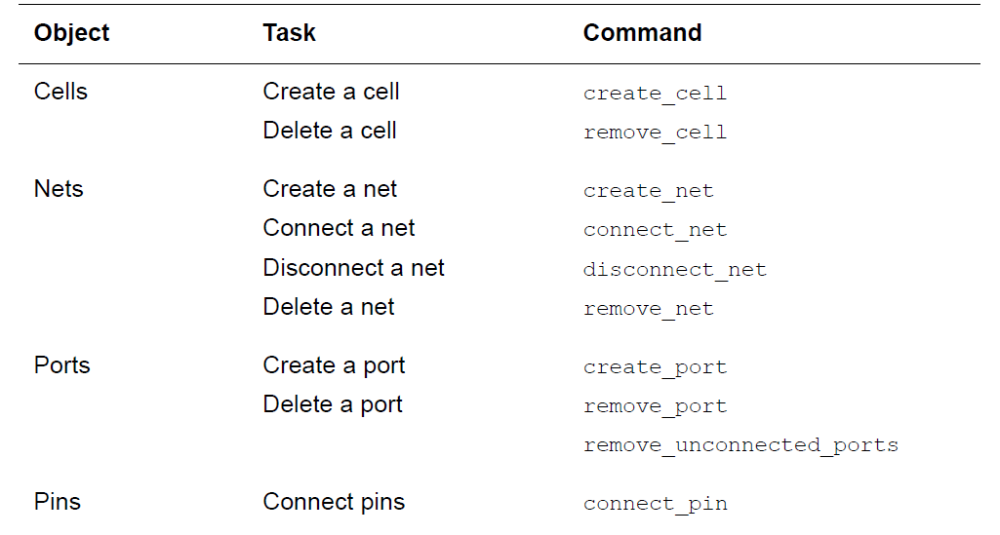

# Read Design

## Reading HDL Files
| 操作 |命令格式 | 使用方法 | 范例|
| --- | --- | --- | --- |
| read_file | -autoread  -format(specify format) | (can read all formats) analyzes the design and translates it into a technology-independent (GTECH) design in a single step. | e.g. read_file -format verilog my_design.v |
| analyze & elaborate | -autoread | (only verilog & VHDL)The analyze command checks the design and reports errors. The elaborate command translates the design into a technology-independent design (GTECH) | e.g. analyze -format verilog -library -work RISCTYPES.v analyze -format verilog -lib -work {ALU.v STACK_TOP.v \ STACK_MEM.v ...} elaborate RISC_CORE -architecture STRUCT -library WORK -update |
| read_verilog/read_vhdl |  | checks the code for correct syntax and build a generic technology (GTECH) netlist | e.g.  read_vhdl my_design.vhdl |

(read_file = analyze + elaborate)

但analyze + elaborate可以自由指定设计库，指定参数和架构等。

## Setting the Current Design

1. *read_file*
2. *elaborate*
3. *current_design*

## Linking Designs

link一些不需要综合的component？比如pad

## Using Attributes

Attributes can describe logical, electrical, physical, and other properties.
| 命令 | 说明 | 范例|
| --- | --- | --- |
| set_attribute | set the value of any attribute or to define a new attribute and set its value | e.g: set_attribute lsi_10K/FJK3 dont_touch true |
| report_attribute | see all attributes on an object | e.g: report_attribute object_list |
| get_attribute | see the value of a specific attribute on an object | e.g: get_attribute OUT7 max_fanout |
| write_script | saving attribute values(not support user-defined attributes) | e.g: write_script > attr.scr |
| define_user_attribute |  | e.g: define_user_attribute -type int -classes cell X |
| propagate_user_attributes | propagate all the user-defined attributes set on all the cell instances | e.g:   propagate_user_attributes {XYZ} |
| remove_attribute | remove a specific attribute from an object | e.g: remove_attribute OUT7 max_fanout |

## Designs
| 操作 |命令格式 | 使用方法 | 范例|
| --- | --- | --- | --- |
| Creating Designs | create_design |  |  |
| Copying Designs | copy_design origin new |  |  |
| Renaming Designs | rename_design | -prefix -postfix -update_links | e.g: D → NEW_D rename_design D -prefix NEW_ -update_links |
| Display the Design Hierarchy | report_hierarchy |  |  |
| Adding Levels of Hierarchy（grouping） **Grouping cells might not preserve all the attributes and constraints of the original cells** | group |  | e.g: 1）group {u1 u2} -design_name SAMPLE -cell_name U 2）group "alu*" -design_name uP -cell_name UCELL (alu prefix) 3）group {mid1/bot1 mid1/cell1 mid1/j} \ -cell_name U1 -design_name SAMPLE 4）group -hdl_block ftj/bar -design_name new_block（将HDL模块bar中的所有cell作为一个group) 5）group -hdl_block ftj -hdl_bussed 2）和3）的区别在于2）形成一个新的design但3）形成一个新的subdesign |
| Removing Levels of Hierarchy（ungrouping） **Designs, subdesigns, and cells that have the dont_touch attribute cannot be ungrouped** | ungroup {high_decoder_cell low_decoder_cell} During Optimization: Explicitly: set_ungroup & compile_ultra/compile -ungroup_all Automatically: compile_ultra|  | e.g: 1）ungroup U1 -prefix "U1:” 2）ungroup -all -flatten（completely collapse the hierarchy） 3）ungroup -start_level 3 CELL_X ungroup -start_level 2 {U1 U2} ungroup -start_level 3 -all |

### Editing Designs(Change the netlist)

（vivado也可以用tcl脚本编辑网表）

### Translating Designs From One Technology to Another

specify library cells：*set_prefer / set_dont_use / set_register_type*

Note：

1. *translate* command does not operate on cells or designs having the dont_touch attribute.
2. *translate* command translates functionality logically but does not preserve drive
translate strength during translation.
3. Buses driven by CMOS three-state components must be fully decoded.（set the
*compile_assume_fully_decoded_three_state_buses* variable to *true* before translating)
4. If a three-state bus within a design is connected to one or more output ports, translating
the bus to a multiplexed signal changes the port functionality.

| in Wire Load Mode | read_file design.ddc set target_library target_lib.db translate |
| --- | --- |
| in Topographic Mode | lappend link_library tech_orig.db  read_verilog design.v  compile_ultra -incremental |

### Removing Design

remove_design -hierarchy / -all

### Saving Design

| .ddc | write_file | e.g: write_file -format ddc -hierarchy -output my_design.ddc（不加hierarchy选项只会保存顶层） |
| --- | --- | --- |
| milkyway | write_milkyway (to save umapped/uniquified designs): 1）uniquify -force -dont_skip_empty_designs 2）write_milkyway |  |

### Name Consistency

