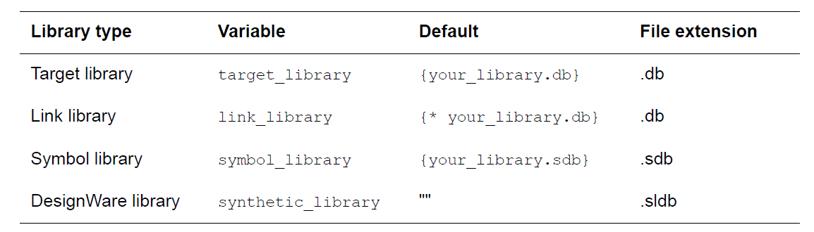

# Specify Libraries

## Library Type

在线负载模式下，DC使用logic library，symbollibrary 和Design ware 库；在拓扑模式下除了以上三种库，DC还需使用physical library。另外，DC 在工作过程中还会产生一个伪库ALIB。

To set up access to the logic libraries, you must specify the **target libraries and link libraries**.

- Target library(Optimization)：contain the cells used  to generate the netlist and definitions for the design’s operating conditions.
- Link library：used to compile or translate a design. define the delay models that are used to calculate timing values and path delays.

### Physical Library

1. milkyway database
    
    Synopsys使用一个统一的Milkyway database可以在Synopsys Galaxy™Design Platform中所有的EDA工具之间进行数据交换，避免了工具之间文件格式转换的大量时间花费，文件之间语义不匹配造成的信息丢失等问题。
    
    IC Compiler从Milkyway database中读取设计信息和库信息，然后执行placement, clock tree synthesis和 routing。也可以将不同阶段的设计信息再保存为Milkyway database
    
2. milkyway library
    
    Cell是Milkyway Library的基本单元，代表芯片版图的物理结构。
    

DC物理库的声明就是通过建立Milkyway Design Library来实现的。建立Milkyway Design Library需要Milkyway Reference Library 和Technology Library 做为输入，二者均由工艺厂提供。Referencelibrary包含标准单元库、IP或宏单元和IO pad单元信息等。

- Milkyway Reference Library包含标准单元库、IP或宏单元和IO pad单元信息等。
- Technology Library包含的是工艺信息。Technology File通常以.tf文件拓展名给出，包含的信息是每层金属或通孔标号number和名称、介电常数、每层的设计规则、每层的物理和电学特性和电子单位精度等。为了更好的预估延时，最好补充RC 信息：TLUPLUS file 和Layer Mapping file，TLUPLUS file包含工艺的物理特性信息，比如层厚度、介电常数、shallow trench Isolatlon和copper dishlng(Desensity Analysis 和width)文件经过starRc工具提取RC模型生成的文件，包含RC查找表，当然该文件也可由工艺厂直接提供；而Layyer mapping文件包含的是technology file和TLUplus file两文件中金属层名称匹配信息。

# Commands

## Loading Libraries

*read_file my_lib.db
read_file my_lib.sdb*

## Specifying Libraries

### Logic Libraries

*set_app_var target_library [list_of_standard_cell_libraries]*

*set_app_var link_library [list * $target_library \$additional_link_lib_files $synthetic_library]*

*set additional_link_lib_files [additional_libraries]*

### DesignWare Libraries(IP)

*set_app_var synthetic_library {dw_foundation.sldb}*
*set_app_var link_library [list * $target_library \$additional_link_lib_files $synthetic_library]*

### Physical Libraries

### Specifying Library Search Path

*set_app_var search_path "lib vhdl default” (directory is “lib” & “vhdl”)*

### Setting Minimum Timing Libraries

link_library variable are used for both maximum and minimum timing information.

*set_min_library* command associates minimum timing libraries with the maximum timing libraries specified in the link_library variable.

*set_app_var link_library {* maxlib.db}
set_min_library maxlib.db -min_version minlib.db*

## Specifying Libraries Objects

### Exclude/Remove exclude cells

*set_dont_use [file:]library/cell*

*remove_attribute [file:]library/cell dont_use*

### Set Disable Timing

*set_disable_timing [get_pins library/cell/pin]*

## Verifying Library Consistency

*check_library*

## Removing Libraries

*remove_design*

## Saving Libraries

*write_lib/write_link_library*

## Using a Subset of the Target Library

可以用于多电压的综合

| Specifying Target Library Subsets | set_target_library_subset
-object_list 
-only_here
-dont_use
-clock_path | e.g1: 整个设计可以使用lib1和lib2，但是block u1只能使用lib2。
set_app_var target_library "lib1.db lib2.db"
set_target_library_subset "lib2.db" -object_list \[get_cells u1]
e.g2:block u1和u2不能使用cells avoid1和cells avoid2。
set_target_library_subset -object_list "u1 u2" \ -dont_use "avoid1 avoid2”
e.g3:SPECIAL cell只能用在block u1和u2中。
1）set_target_library_subset -object_list "u1 u2" \-only_here "SPECIAL”
2）set_target_library_subset -top -dont_use "SPECIAL"（限制顶层不能用SPECIAL)
set_target_library_subset -object_list "u1 u2”(u1、u2可以使用整个库）
e.g4:在时钟路径上使用INVX1, MUX1, and NOR2 library cells。
set_target_library_subset clocklib.db \ –clock_path –use [INVX1 MUX1 NOR2] |
| --- | --- | --- |
| Checking Target Library Subsets | check_target_library_subset |  |
| Reporting Target Library Subsets | report_target_library_subset |  |
| Removing Target Library Subsets | remove_target_library_subset
reset_design |  |

link library subset用法和target library相同