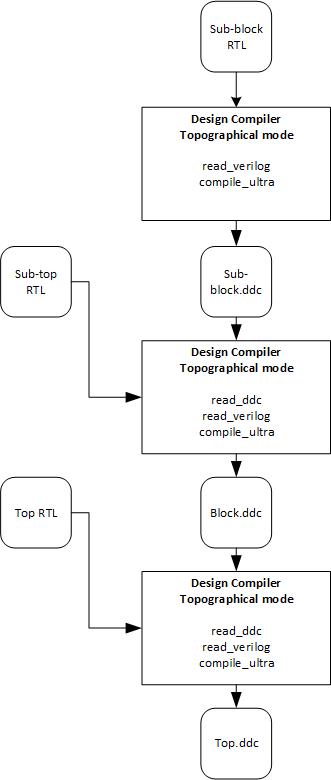
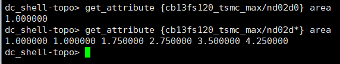
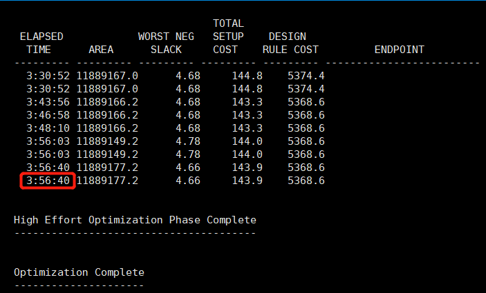
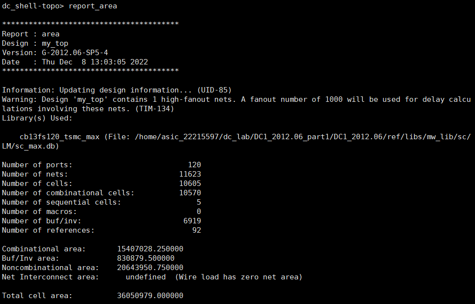
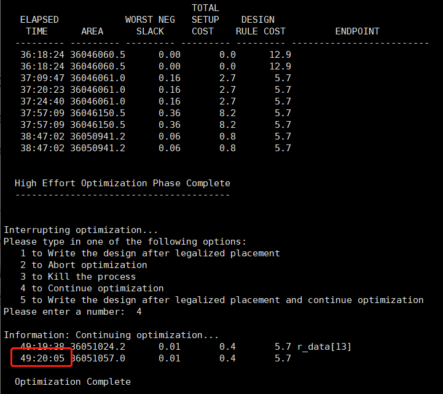
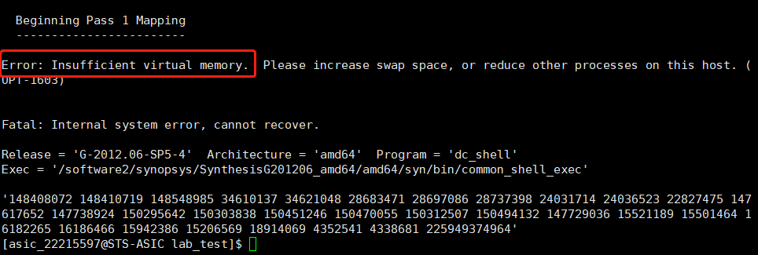

# DC记录
成员：郭家怡，黄静雯，周沁茗

## 思路

分块编译，解决大规模设计编译时占用内存过大的问题。

1、先将sub-block(4096*32bit寄存器堆)编译成ddc文件。

2、预编译好的sub-block导入到Synopsys DC，顶层RTL代码使用generate例化多个sub-sub-block。

3、再次编译顶层设计。

4、编译好的顶层保存为ddc文件，作为block

5、重复3、4步骤，得到最终的编译结果


## 编译流程

<div style="text-align:center">

</div>

顶层RTL代码：
```verilog
module my_top_top(
    input wire clk, 
    input wire rst, 
    input wire[31:0] w_data, 
    input wire[11:0] w_addr,
    input wire[11:0] r_addr, 
    output wire[31:0] r_data,
    input wire [59:0] top_csel);
    genvar i;
    wire [31:0] r_data_top_array[1:0];
    wire [1:0] top_sel;
    assign top_sel[0] = |top_csel[29:0];
    assign top_sel[1] = |top_csel[59:30];
    generate
        for (i = 0; i < 2 ; i = i+1) begin
            my_top my_top( 
                .clk(clk), 
                .rst(rst & top_sel[i]), 
                .w_data(w_data & {32{top_sel[i]}}), 
                .w_addr(w_addr & {12{top_sel[i]}}),
                .r_addr(r_addr & {12{top_sel[i]}}), 
                .r_data(r_data_top_array[i]),
                .csel(top_csel[(29+i*30) : (0+i*30)])
            );
        end    
    endgenerate
    assign r_data = top_sel[0] ? r_data_top_array[0] : r_data_top_array[1];
endmodule
```

sub-top的RTL代码：

```verilog
module my_top(
    input wire clk, 
    input wire rst, 
    input wire[31:0] w_data, 
    input wire[11:0] w_addr,
    input wire[11:0] r_addr, 
    output wire[31:0] r_data,
    input wire [29:0] csel);
    genvar i;
    wire [31:0] r_data_array[29:0];
    generate
        for (i = 0; i < 30 ; i = i+1) begin
            array array( //4096个32bit寄存器，存储成ddc供dc调用(约160万门）
                .clk    (clk   ), 
                .rst    (rst & csel[i]  ), 
                .w_data (w_data & {32{csel[i]}}), 
                .w_addr (w_addr & {12{csel[i]}}), 
                .r_addr (r_addr & {12{csel[i]}}), 
                .r_data (r_data_array[i]) );
        end    
    endgenerate
reg [5:0] read_sel;
always@(posedge clk)begin
    case(csel)
    30'b00000_00000_00000_00000_00000_00001: read_sel <= 0;
    30'b00000_00000_00000_00000_00000_00010: read_sel <= 1;
    30'b00000_00000_00000_00000_00000_00100: read_sel <= 2;
    30'b00000_00000_00000_00000_00000_01000: read_sel <= 3;
    30'b00000_00000_00000_00000_00000_10000: read_sel <= 4;
    30'b00000_00000_00000_00000_00001_00000: read_sel <= 5;
    30'b00000_00000_00000_00000_00010_00000: read_sel <= 6;
    30'b00000_00000_00000_00000_00100_00000: read_sel <= 7;
    30'b00000_00000_00000_00000_01000_00000: read_sel <= 8;
    30'b00000_00000_00000_00000_10000_00000: read_sel <= 9;
    
    30'b00000_00000_00000_00001_00000_00000: read_sel <= 10;
    30'b00000_00000_00000_00010_00000_00000: read_sel <= 11;
    30'b00000_00000_00000_00100_00000_00000: read_sel <= 12;
    30'b00000_00000_00000_01000_00000_00000: read_sel <= 13;
    30'b00000_00000_00000_10000_00000_00000: read_sel <= 14;
    30'b00000_00000_00001_00000_00000_00000: read_sel <= 15;
    30'b00000_00000_00010_00000_00000_00000: read_sel <= 16;
    30'b00000_00000_00100_00000_00000_00000: read_sel <= 17;
    30'b00000_00000_01000_00000_00000_00000: read_sel <= 18;
    30'b00000_00000_10000_00000_00000_00000: read_sel <= 19;

    30'b00000_00001_00000_00000_00000_00000: read_sel <= 20;
    30'b00000_00010_00000_00000_00000_00000: read_sel <= 21;
    30'b00000_00100_00000_00000_00000_00000: read_sel <= 22;
    30'b00000_01000_00000_00000_00000_00000: read_sel <= 23;
    30'b00000_10000_00000_00000_00000_00000: read_sel <= 24;
    30'b00001_00000_00000_00000_00000_00000: read_sel <= 25;
    30'b00010_00000_00000_00000_00000_00000: read_sel <= 26;
    30'b00100_00000_00000_00000_00000_00000: read_sel <= 27;
    30'b01000_00000_00000_00000_00000_00000: read_sel <= 28;
    30'b10000_00000_00000_00000_00000_00000: read_sel <= 29;
    endcase
end
    assign r_data = r_data_array[read_sel];
endmodule
```
## DC综合结果记录

### 例化10个sub-block的综合结果

工艺库：TSMC 90nm，最小标准单元2输入NAND面积1.00
```tcl
get_attribute { technology library/2_input_nand_gate_name } area
```



门数即面积。

运行时间：
编译sub-block 2h，编译顶层模块4h。


### 例化30个sub-block的综合结果



运行时间：
编译sub-block 2h，编译顶层模块49h20min。


## 将例化30个的ddc保存下来作为block
### 例化两个block作为最终设计

constraint script里设置最大面积1亿
```tcl
set_max_area 1000000000
```
DC编译时采用时序优先
```
compile_ultra -timing_high_effort_script
```

### 结果：Virtual Memory 不够


### Appendix 
运行脚本
```tcl
read_ddc my_toplevel_ddc.ddc
analyze -f verilog my_top_top.v
elaborate my_top_top
source scripts/test.con
compile_ultra -timing_high_effort_script
report_area
write -f ddc -hierarchy -output my_top_top_ddc.ddc
```