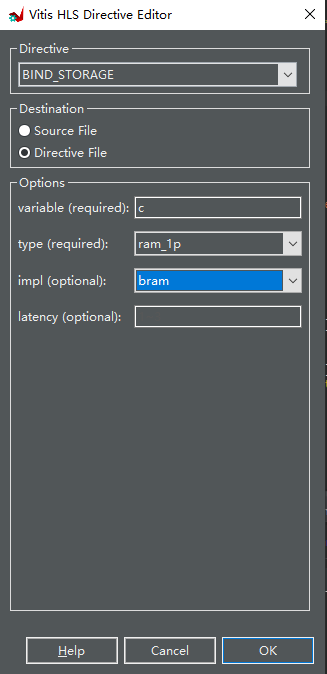

# HLS ug871 tutorial

Change Vivado HLS to Vitis HLS

### command

vitis_hls -f run_hls.tcl

vitis_hls -p prj

1. p33
    
    
    
2. p36 analyze
    
    没找到analysis button在哪里
    
    
    
3. P42 Compare Report
    
    看上去vitis确实比viviado hls优化了
    
    
    
    
    
4. Interface Synthesis实验
    
    实验内容：一个三输入的加法器
    
    
    
    |  | solution1 | solution2 | solution3 | solution4 | lab4 |
    | --- | --- | --- | --- | --- | --- |
    | 算法 | 直接相加 | 输出用pointer | for循环相加，输入输出都是array | for循环，输入输出都是array | array → AXI Interface |
    | HLS优化策略 | 输入是ap_none接口 | 输出综合成为一个inout接口
    in1：ap_vld
    in2: ap_ack
    inout: ap_hs | -HLS默认array综合成RAM Ports
    -将输入输出部分展开（directive设置成block） | -UNROLL全部展开输入输出（directive设置成complete） | - partition the arrays
    -Unroll loop
    -pipeline loop |
    
    
    
    可以看出来solution4占用的资源不是最多的，延时是最小的
    
    lab4延时略增加，面积更小了
    
5. P109 Design Analysis 如何降低latency
    
    solution1:
    
    
    
    pipeline后(solution2)：
    
    
    
    为什么solution2 latency还变大了？？？
    
    solution3:
    
    
    
    solution4:
    
    
    
    solution5:
    
    
    
    solution6:
    
    
    
    Compare:
    
    
    
6. P137 Design Optimization (3*3矩阵相乘）
    
    有violation？
    
    
    
    pipeline后没有violation
    
    
    
    solution3又有violation
    
    
    
    solution4：
    
    
    
    solution5：
    
    
    
    solution6也有violation
    
    
    
7. RTL Verification
    
    Lab1：无法跑C synthesis
    
    
    
    lab2：
    
    
    
    lab3：
    
    
    
    error：
    
    
    
8. Using HLS IP in IP Integrator
    
    vitis生成的HLS IP接口、vivado生成的HDL Wrapper接口名字和tutorial的testbench名字不匹配，需要自己修改
    
9. 最后一个实验：Package HLS IP for System Generator
    
    根据xsetup，System Generator已经被整合到Vitis Model Composer里面了
    
    
    
    *需要下载matlab