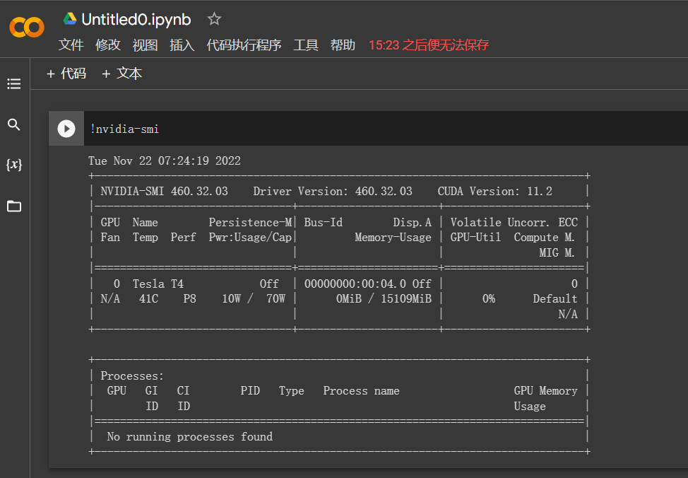

# 记录

Google Colab

### train_promote.ipynb

训练10个epoch

1、96，64，1

2、增大第一层神经元的个数：96→256

3、增加一个全连接层，96

4、增加dropout

### 使用keras tuner确定超参数

不加uniform的模型

加了uniform

激活函数换成relu

更新：

激活函数Relu → 对应初始化适合用henormal而不是uniform

模型：

尝试将模型加到5层

还是使用3层的模型，损失函数换成mean abs error

