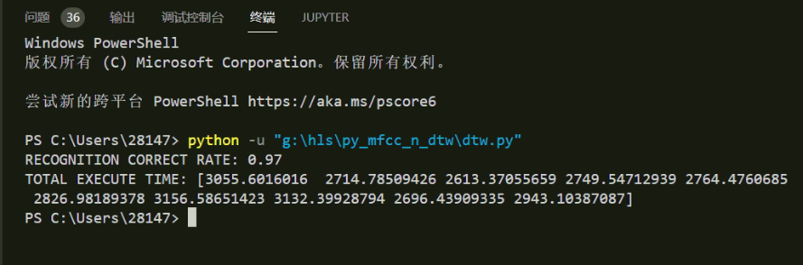

# Result

python上的运行结果：（测试100次）

VS code的运行结果：（编译器MinGW）

Visual Studio的运行结果：(不要用Debug模式，用Release）

1、正确率

2、调试模式看资源使用率

计算DTW的函数占用了较多资源

其中计算距离的函数占用了大量的CPU资源

内存：

重复匹配10次，所以内存总共下降9次（最后一次全部释放）

Zedboard运行结果：

vector类的内存不够

### 需要分配堆栈内存

