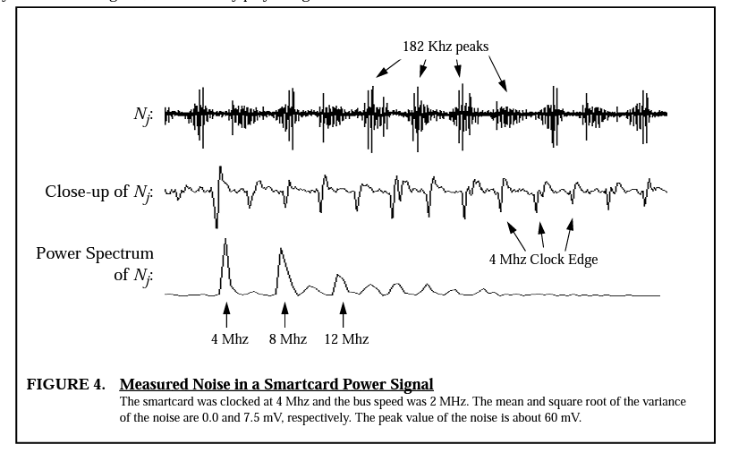
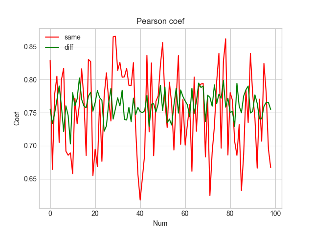
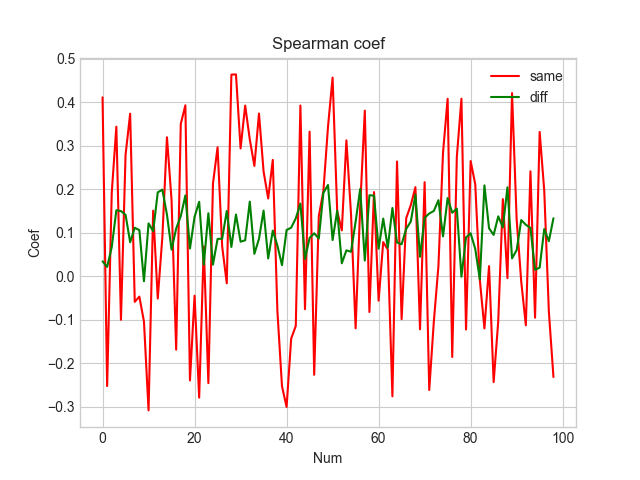
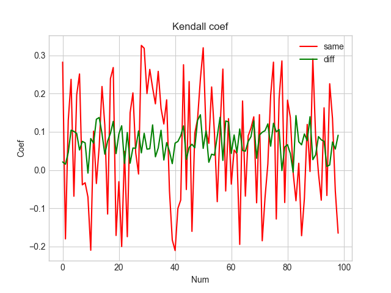
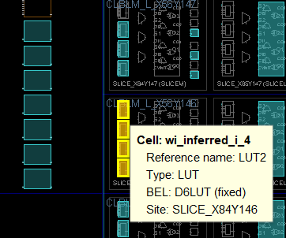

# 2022/12 记录
### 2022/12/04
分别使用pearson、spearman、kendall相关系数进行评估

发现在使用高通滤波器滤波后，效果更好

原因可能来自于时钟信号产生的固定频率噪声

source论文：Investigation of Power Analysis Attacks on Smart Cards

使用截止频率为15000Hz的HPF:

换成10000Hz的HPF

换成BSF？

时钟主要集中在一个频率上

500-10000的BSF

## 2022/12/07

[更精细化的物理约束](https://blog.csdn.net/Archar_Saber/article/details/123663051)

> set_property LOC SLICE_X84Y146 [get_cells [list sensor0/test0/ring_osc/wi_inferred_i_1]] # 将来自网表的一个逻辑元素放置到FPGA元器件内的一个位置
>set_property is_bel_fixed true [get_cells [list sensor0/test0/ring_osc/wi_inferred_i_1]] # 将来自网表的一个逻辑元素放置到FPGA元器件上一个切片内一个指定的BEL上

效果

