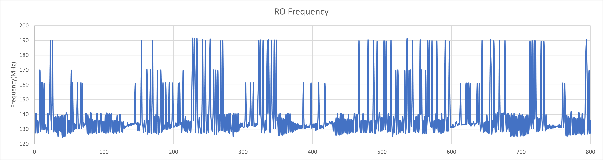

# 2022/12 记录
### 2022/12/04
分别使用pearson、spearman、kendall相关系数进行评估

发现在使用高通滤波器滤波后，效果更好

原因可能来自于时钟信号产生的固定频率噪声

source论文：Investigation of Power Analysis Attacks on Smart Cards

使用截止频率为15000Hz的HPF:

换成10000Hz的HPF

换成BSF？

时钟主要集中在一个频率上

500-10000的BSF

## 2022/12/07

[更精细化的物理约束](https://blog.csdn.net/Archar_Saber/article/details/123663051)

> set_property LOC SLICE_X84Y146 [get_cells [list sensor0/test0/ring_osc/wi_inferred_i_1]] # 将来自网表的一个逻辑元素放置到FPGA元器件内的一个位置
>set_property is_bel_fixed true [get_cells [list sensor0/test0/ring_osc/wi_inferred_i_1]] # 将来自网表的一个逻辑元素放置到FPGA元器件上一个切片内一个指定的BEL上

效果

优点：比划分pblock更准确

## 2022/12/09

发现设置`timescale的不同会导致电路后仿的结果不同

#### ps级（no `timescale，默认是ps级）

#### ns级（`timescale 1ns/1ps）

## 2022/12/10
尝试将DSP布局到周围

## 2022/12/12
测量模块仿真没有问题，准备将测量模块布局到CPU内

## 2022/12/13
ila抓波形没看到有问题，但是测出来的频率波动非常大
**猜测：写入没问题，是不是读出有问题？**

有ila在测出的波形（*是不是ila引入了让环形振荡器稳定的因素？*）

## 2022/12/14
在没有手动布局情况下的RO振荡频率。（问题应该出在手动布局上）

试一下减少级数？（级数减少应该会引入不稳定因素）
_3级反相器_

_31级反相器_
