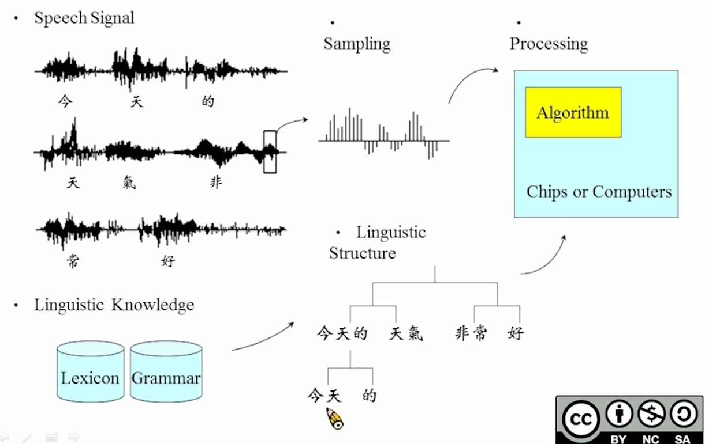

# 01-Introduction to Digital Speech Processing

1. 采样
    
    x(t) → x[n]
    
2. 从x[n] 进一步进行处理
3. 语音的特点：包含许多人的信息，具有双层的资讯
4. 处理：同时处理语音和语法（语音知识 & 语言知识）
    
    
    
5. Personal Asisitant(Voice-based Network Access)的流程
    
    
    
    语音处理 → 提取信息 → 根据信息处理 → 返回信息 → 语言处理 → 语音合成 （云端实现）
    
    在Voice-based Network Access这一部分主要分为User Interface、Content Analysis、User-Content Interaction三大块。
    
    1. User Interface:人和机器交互最方便的就是声音，比如说语音控制家电、高德语音导航等。缺少市场化产品，所以发展空间比较大。
    2. Content Analysis:网络端比如说google、YouTube等的语音可以对其进行内容的分析。
    3. User-Content Interaction:比如说语音版的google，语音输入语音输出方式取代文字输入寻找相关内容等等。再比如说多模态融合方式实现人机对话，举个例子：订旅馆，任何机器交流的时候不仅仅可以通过语音输入，还可以通过手指操作实现订旅馆的任务。
6. 语音识别流程
    
    
    
    LVCSR的常用架构：
    
    
    
    - 从信号中抽取出每一个基本音（大概几十个），根据基本音提取出pattern，建立model（acoustic model）。
    - 词典（Lexicon）：基本音组成的词汇（**基本音之间难以区分**）
    - 语言模型（Language Model）：根据语法判断出现词的概率
        
        bi-gram：两两相连的概率
        
        tri-gram：三个词相连的概率
        
    
7. 语音识别task
    
    
    
    重要的问题：
    
    - 不同的人说话声音不一样 → 训练的说话人数据和测试的不一样，可以识别吗？
        
        Adaptive：学习讲话人的说话特点
        
    - 背景杂音
    - 通过云端传输时信号会失真
    - 离太远麦克风采集的信号微弱
    - 讲话不清晰
    
8. 语音合成（Text2Speech Synthesis）
    
    
    
    问题：
    
    Prosodic modeling（抑扬顿挫），希望机器模拟人说话的方式，不同的声调代替不同的意思
    
    model based：建模让机器学习
    
    分析text里面有哪些词，这些词对应哪些音 → 输入到Prosodic modeling决定音调 → 语音合成
    
9. 语音了解（Speech Understanding）
    
    让机器理解语言的意思（目前仅限于一些特定的领域可以实现）
    
    
    
    机器抓取语言中的关键词
    
10. 识别特定说话人
    
    
    
    为每一个speaker建立一个model
    
    难点：建立model后，不管说话人说什么话，都可以识别出这个说话人（不依赖于说话的内容， text-independent）
    
11. 根据声音进行检索
    
    通过文字找语音，通过语音找文字
    
12. 语音对话（较复杂的task）
    
    
    
    e.g.语音买飞机票
    
    流程：语音了解、语音合成、掌控对话的流程…(许多语音技术的合成）
    
    分为系统主导/用户主导/mixed（系统主导比较简单，mixed目前比较成功）
    
    系统需要可靠性、有效性等，可靠性根据success rate进行评估，有效性根据turns评估（成功做成一个任务需要多少轮对话）
    
13. 语音文件的了解与重组
    
    新闻/课程等语音不是容易浏览的，需要以可视化的形式让用户浏览
    
    分割（segmentation） → 总结 → 建立标题 → 抽取key term（可以实现可视化） → 语义上形成相关的树结构，方便用户去浏览相关内容
    
14. 多语言
    - 说话期间换了语言（有一些词是其他语言）
    - 跨语言信息处理（用户输入某种语言，希望检索到所有语言的结果）
    - 方言/口音
    - Global/Local语言识别
    - 三个方向：code-switching（不同语言间切换） / speech-to-speech traslation（不同语言相互翻译） / computer-assisted language learning
15. computer-assisted language learning（电脑协助语言学习）
    
    降低语言学习的成本