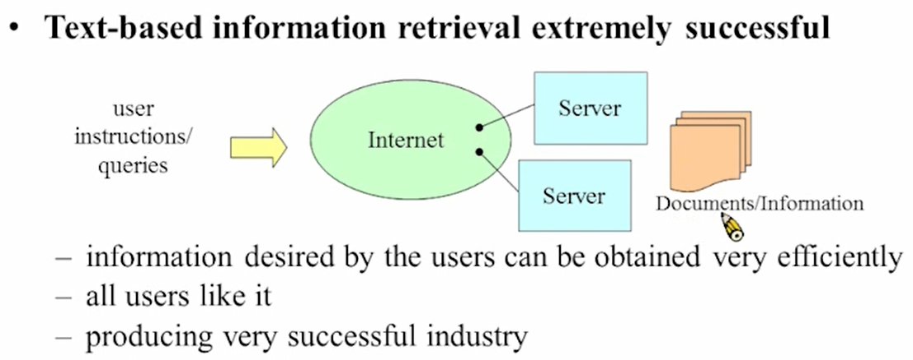

# 10-Speech-based Information Retrieval

就是语音版的google，希望用语音找语音，语音找文字(voice search)，文字找语音（spoken document retrieval)。文字版的已经非常成功。

# Basic Approach

1. 先语音识别成文字，再去research
    
    问题：辨识率很差的情况下，效果就很差
    
    solution1：把语音变成lattice
    
    
    
    problem：OOV的词汇可能是正确的输入，正确率仍然不会很高，并且计算量和存储量大大增加
    
    solution2：把易混淆的做成Confusion matries
    
    solution3：pronunciation modeling
    
    solution4：fuzzy matching，把可能相关的信息都找来
    
2. OOV的词汇处理
    
    使用subword unit去处理，OOV的词汇由subword unit拼出来
    
    
    
    怎么得到subword unit？
    
    
    
3. 评估表现
    
    B是机器找到的，A是正确的，C是正确但机器没找到的
    
    
    
    user对precision比较敏感，这两种正确率受threshold的影响
    
    
    
    recall-precision curve，受阈值影响。
    
    map: area under curve，越大的性能越好
    
    
    

# Vector Space Model

最传统，早年最成功的做法

核心思想：输入的query（语音）转换为一个vector，搜到的document也转换为一个vector，求两个vector的内积。

vector可以以以下为单位，可以一定程度上克服OOV问题。

数学表达：

$ln(N/N_t)$：评估词语的重要性，比如英文中the、中文的，在每篇文章中都会出现，$ln(N/N_t)$ =0，表示他们不重要

用文章的长度做归一化

cosine similarity：内积除模长=cosine

j指计算vector的单位不同，可以对不同的j赋不同的权重

 

## Diffculties in Speech-based Information Retrieval for Chinese

### Problem

1. 中文是非常灵活的
    
    
    
2. 断词
    
    
    
3. OOV/多识别一个、少识别一个、漏识别一个

### Solution

- syllable level
1. Overlapping  syllable segments with length N
    
    效果最好的是N=2和N=1，既可以克服OOV问题，也可以减掉一些噪声。并且中文中双字词最多，克服构词问题。
    
2. Syllable pairs separated by M syllables
    
    跳M个音去比对，实践中发现跳一个音效果最好。解决简写，构词等问题。
    
3. Syllable-aligned Lattices
    
    比对时可以取前几个最可能的syllable，但也会引入很多噪声；可以根据每个可能的syllable算score，根据score选择。算syllable的IDF，很低的就去掉
    
- Expected Term Frequencies

算lattice出现的概率

u是任何一个path，P是他出现的概率，给每一个path赋不同的权重

# WFST for Retrieval

1. Factor Automata
    
    将包含输入query的substrings也作为关键词，但是每个不同的substring有不同的权重。
    
    
    
    在前后都多加一个可以连到全部的状态，这样就可以accept全部的substring
    
2. lattice就可以产生全部的transducer
    
    
    
    
    
    每句话都做成这样的WFST，这样就可以针对输入的query，把它拆成substring，比如words，characters，syllables，加上不同的weight，去检索每一句话。
    
    
    
    识别过程：
    
    
    
    把输入query的transducer和documents的transducer做composition
    
    # Improved Retrieval by Training
    
    ## Train Data source
    
    - click search
        
        
        
        从用户检索的信息内收集，用
        
    - Pseudo-relevance Feedback(PRF)
        
        用户输入一个Q，假设找到的最前面的是相关的，最后面的是不相关的。再把最后面不相关的和最前面的相关的求相似度，比较相关的就往上加他的分数，rescore后的结果再给用户。这样训练的数据就可以自己产生，不需要用户点击。
        
        
        
        相似的评估：DTW找到最佳的路径，用这条路径算他们的距离
        
        
        
    - Graph-based Approch
        
        克服PRF简单地把把前面认为是相关的，后面认为不相关的问题
        
        把找到的结果做成一个graph，每个node之间的链接就作为它们之间的相关度。
        
        relevance score propagate ： 根据几个互相相连的node的相关度来评估，如果一个聚集的nodes中只有一个链接比较低分，那么就应该相应调高这个链接的分数；反之需要调低。
        
        
        
        怎么调节score：
        
        - PageRank and Random Walk(early Google)
            
            如果一个node和很多node相连，那么他的相关度较高，应该调高score
            
            
            
            $s_i = \alpha \sum_jp_{ij}s_j+(1-\alpha)v_i$，流动＋本身，每一部分赋权重。
            
            
            
            收敛时，$s = P's$.
            
            
            
        - Support Vector Machine
            
            有很多超平面都可以分离两类，但存在一个最好的超平面（margin最大）
            
            
            
            margin：最靠近平面的点到平面的距离
            
            support vectors：最靠近平面的向量
            
            soft margin：训练数据中有一些特别的数据，忽略他们，只考虑大多数向量的分布
            
            
            
            可能不一定存在一个平面把它们分开，但是可以做feature mapping，把这些向量映射到更高维的空间，在更高维可能存在一个平面把它们分开。
            
            **用SVM做搜寻（SVM & PRF）**
            
            用svm做重排序。
            
            
            
            每个句子要得到一个vector去训练svm，这个向量可以通过以下的方法获得：
            
            把query数据中和要检索的关键词相似的语音拿出来，假设这段语音由10个tri-phone组成，每个tri-phone有三个state，一共就有30个state。每个state里的support vector相似度较高，可以对他们求平均，作为代表这个state的vector。对30个state做完后，有30个39维的向量，串成一个大的vector，在30*39维的空间去训练svm。
            
            
            
            正确的词前后文往往是有联系的，根据前后文也可以找到正确的识别词。
            
            Q是正确的识别词，把前后文出现的词的概率写出来。把前后文和识别词串起来作为一个大的vector去训练svm。
            
            
            
        
    
    ## HMM Parameter Re-estimation
    
    
    
    把retrieval和recognition结合，用retrieval的结果去调节acoustic model。
    
    
    
    Train的目标不是为了正确率最高，是为了正确答案和错误答案的区分度越高。
    
    正确答案和错误答案的score之差越大越好，对于一堆输入的query，希望他们的score之差的和越大越好，在最大化分数之差的过程中，就可以调节acoustic model，使得这个分数之差最大。
    
    
    

# Language Modeling Retrieval Approach

query和document做成两个Language model，算query Q输入model和document D输入model的KL散度，判断query对应的document。

## semantic retrieval by query expansion（调整query model）

user想要找和obama相关的资料，但是有一些资料中没有obama这个关键词，但是有和Obama相关的词，比如whitehouse、US……

因此可以扩充query，将这些高度相关的词也放进去，希望能找到更多相关的资料。

做法：

1. 用用户输入的query去检索对应的document
2. 取其中最相关的几个document，看他们的language model中出现次数最多的词汇
3. 在这几个model中出现频率最高的词汇就作为新的query model
4. 再去检索document，返回结果给用户

Concept matching rather than literal matching

## semantic retrieval by document expansion（调整document model）

### latent topic analysis

语言的topic model：文章对应topic  distribution，topic对应terms distribution，这就是语言的topic model

把文章添加一些新的topic，也就是说把documents和query之间建立新的联系，比如obama和以whitehouse、US相关的文章有联系。

# Unsupervised Spoken Term Detection(STD) with Spoken Queries

用语音搜语音：可以不用理解在说什么（no recognition）

因为理解在说什么的话需要有大量由人标记的数据（supervised）

自然也就没有OOV、识别错误、特定领域等问题

## Template matching

比对两段语音的相似程度进行搜索

- dynamic time warping（计算量非常大）
    
    
    
- segment DTW
    
    信号切成segment，只计算segment的相似程度
    
    
    
    HAC切分segment，计算相邻的相似程度，相似就merge，一层一层向外merge，在任何一点切分这棵树，就可以得到不同粒度的segment
    
    
    

## Model-based Approach

语音之间做匹配，由于说话人的特征、口音等，不是很容易匹配。

Unspervised data: learn models from data

### Train

1. 数据可以先用HAC去聚类，分群
2. 针对HAC分出来的群，机器自动label，每个群train一个intitial model
3. 使用机器分的群，重新去做label

可以得到音的model，再看哪几种音常常在一起，再得到一个类词的model，这个过程是完全unsupervised

