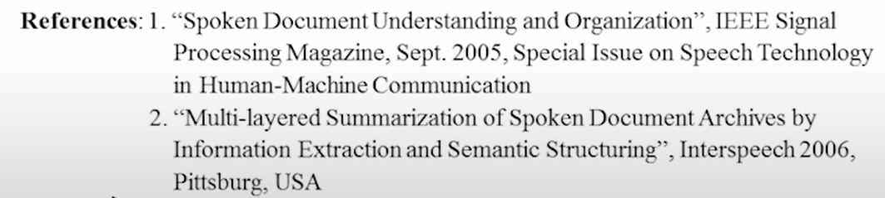

# 11-Spoken Document Understanding and Organization for User-content Interaction

# User-content Interaction for Spoken Content Retrieval

问题：检索到的语音内容难以呈现在屏幕上，用户很难选择

solution：

1. 抽取key terms/titles/summaries
2. 建立semantic structure
3. 建立multi-model和用户互动

# Multi-media/Spoken Document Understanding and Organization

41：49

1. 抽取关键词和标题，但这些词汇往往是OOV的，比如人名，地名etc
2. 分段（segmentation），需要按照内容来切分
3. 信息抽取，往往就是理解key terms之间的关系
4. summary
5. topic
6. 分析topic，再组织multi-media和document

在不同的level对语音文件做分析和组织，可以从上到下、从下到上迭代

## Key Term Extraction

Key terms：短语和词组

1. 探测边界：
    
    
    
    可以算概率，根据前后文词汇的分布去求
    
2. 判断是否为key term
    - 可以根据抑扬顿挫（Prosodic）去判断，当人讲到核心的关键词的时候语速会放慢，根据这一点可以判断出关键词
    - topic：假如一个词只出现在一个特定的topic里，那么他就是关键词（求entropy）
    - TF/IDF，知道词类，名词更高几率是
        
        
        
    

## Extrative Summarization of Spoken Documents

1. 将原始语音文件中的关键句抽取出来作为总结，那么个别词语识别错误也没关系，因为user听到的是原始数据。可以设定一个抽取的比例

## Title Generation

用人已经标好title的语音文件做好一个model

## Semantic Structure

希望把语音文件做成更好理解的结构，比如一级一级向下展开的树，每一层的每一块都抽取一个共同的key term

做一个key term graph，key term之间有相互联系，每个key term可能对应很多个语音文件。

## Multi-model Dialogue

希望系统和user之间对话，找到更精准的数据，减少user浏览的次数

# Spoken Document Summarization

现在信息量很大，需要给很多详细的内容做摘要，需要机器去做

会议记录，电视新闻，etc

问题：识别的错误率，声音中有情感、说话人等文字无法体现的特征

## Unsupervised Approach : Maximum Margin Relevance(MMR)

文字和声音都可以应用这个办法

假设目前有一篇文章，有很多句子，计算每个句子和文章的相似度（TF/IDF)

如果有好几个句子都和全文很像，考虑这几个句子之间的相似性，相似的几个句子就删掉重复的，最后得到的几个句子就是全文的summary

## Supervised Approach

比如训练一个SVM，效果可能比无监督的要好

### Domain Adaptation

用已经训练好的supervised model去适应到另一个领域

怎么调节已训练好的模型？

1. 先直接把out-of-domain的模型拿过来，在target domain做识别，得到target domain的summary。
2. 把target domain和out-of-domain的summary拿过来再去训练一遍，得到一个新的model
3. iteration

但是效果不会太好

**前面的summary都是在原始的内容中抽取句子，但是人做的summary是抽取关键词后重新造句**

## Abstractive Summarization

把所有抽取的句子提取词语做成node，句子就是path，画成一个graph。在句子里当过句首的都作为start node，当过句尾的都做成end node。

start到end的都可能是summary，但是需要应用language model去评估通不通顺

# Multi-modal Interactive Dialogue

当找到的document非常多样化，问user要更多的关键词，缩小检索范围

## Markov Decision Process

是一个数学模型

简单来说，就是系统有不同的状态S，对应每个状态，系统要采取对应的行动A，每个行动都评一个分数R，有一个policy的集合pi，policy表示每个状态下该采取的行动。

我们的目标就是最大化policy集合pi的分数

用图表示：

S1表示第一次检索出来的结果，系统tak action，再检索到状态S2……

### Reinforce Learning

学习很多良好的policy

# Question-Answering in Speech

知识来源也可以是语音

## 3 Types

### Factoid AQ

根据user的语音，做成查询指令去google

还要知道用户的问题问的是什么（应该答什么东西）

例子：IBM系统参加问答节目

### Definitional QA

需要找到一堆数据之后，做总结