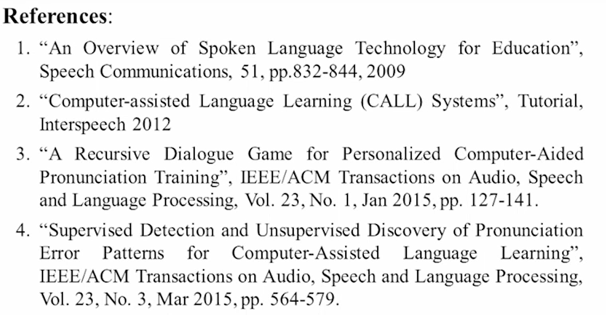

# 12-Computer -Assisted Language Learning(CALL)

1、2overview

# CALL

1. 希望可以在多种语言之间切换
2. translation
3. 语言学习：一对一学习效果最好，但是成本太高，希望用语音技术来做
4. 优势：reproduce，anytime&anywhere

## Target Skill

目前发展的最好的是发音的学习。

### Pronunciation Learning

问题：机器无法判断发声过程的问题，无法纠正人的发音

- Computer-Aided Pronunciation Training
    
    用机器给人的语音打分
    
- Spoken Dialogue System
    
    可以和机器联系对话
    

机器检测的过程中需要建立模型，去打分，要有一定的容错度，需要建立发声的模型，给人的发音打分

### Error Pattern Detection

比如母语中没有某些发音的人，在学习外语的时候无法发出母语中没有的音。在识别过程中需要给每个可能的错误pattern建立模型，在人念错的时候就可以去评估哪里念错了

怎么打分？

1. 计算和母语者说的相似程度，找一群说的比较好的人作为golden speaker，用他们的发音去训练一个模型。
2. 让语言老师去打分，用老师打的分去训练模型，让机器可以模仿人去打分
3. intelligibility：如果说话者每个音都发的清晰可辨，即使不标准，母语者也可以听懂，就算念对了

# Example

## 台大华语软件

给范例句子发音，让学习者自己念，机器对齐后评估每个音的发音

### 对话游戏

学习一段时间后，可以得到音念的分数的分布，希望给用户多练习念的不好的音

用户念不好的音在对话游戏中更多的出现，做到个人化的学习。

机器自动根据user学习的情况，产生不同的对话练习

### 实现过程

先建立对话的剧本，做成一棵树

餐厅的场景有9个sub-dialogue

每个路径上的units的分布会差很多，可以选择用户发音较差的units分布多的sub-dialogue进行对话游戏。机器把每条路径都算一遍，看看哪一遍最好（reinforce learning和MDP）

MDP：

state：目前用户的学习状态

action：机器和用户的对话

goal：用户发音的分数设定一个目标，比如user较差的音得分75以上十次

reward：每多念一次就扣分，希望user在最短时间内掌握，希望最大化reward（用户500次可以学会一个发音，最好不要念501次）

走到最后的St状态，就表示学习完成

### Learning Simulation Model

从真人的学习状况去训练model，因为母语不同的人，发音的状况会不一样

分数进步也训练一个model，学习的过程中均值会提高，方差会减小

整个系统架构：

