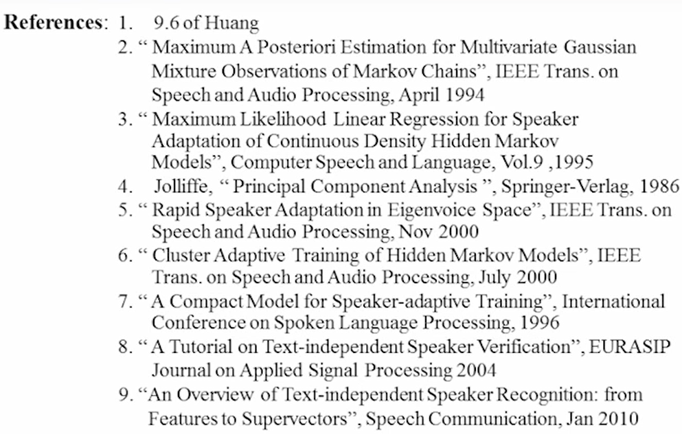

# 13-Speaker Varibilities: Adaption and Recognition

HMM中经典的识别方式

较好的方法：speaker adaptation，又可以分为supervised & unsupervised

adaptation：

# 三种经典的adaptation

## Maximum A Posterior Adaptation

有一个v点与ot做内插，根据比例移动v点（v是原来高斯分布的均值，ot是新的向量）$\tau_{jk}$调节移动过去的幅度。

缺点：需要足够大量的数据，模型才会向前进步。并且没有给到的新数据（unseen），就不会进步。

## Maximum Likelihood Linear Regression(MLLR)

Unseen的model可以进步

原理：对于音进行分群，只要这个群里有音被说到，调整的幅度为$a_{x}，b_{x}$，那么这一整群的语音model都用这个参数去调整。

缺点：比较粗糙

A是39*39的矩阵，参数较多，可以把A简化为对角阵或者block-diagonal阵。→ 可以更快的adaptation，但是accuracy saturation的值比较低

分群的粒度要适当，每群data的数目可以训练出$a_{x}，b_{x}$就作为一群

### Tree structure

相似的分在一起，往上分到可以训练出$a_{x}，b_{x}$的程度。如果本来就够多的，就sharing到不够数据的音的model（dynamic adjust）

## Eigenvoice

### Principal Component Analysis（主成分分析）

N维空间上的数据，希望找到一个轴$\overrightarrow{e_1}$，把这些数据投影到这个轴，让他们分的更开；再找一个垂直于$\overrightarrow{e_1}$的轴$\overrightarrow{e_2}$，也使数据投影到$\overrightarrow{e_2}$上分的最开。依此类推找到$\overrightarrow{e_3}$……

解法：求协方差矩阵的特征向量，特征值最大的多个特征向量的集合，就是这个垂直轴向量的集合。

降维：把前最大的k个特征值对应的k个特征向量，可以看作创建一个新的k维子空间，把更高维的特征$\overrightarrow{x}$映射到这个子空间上，得到降维后的向量$\overrightarrow{y}$。降维前后的协方差矩阵基本一样。

PCA通常用来降维

### Eigenvoice

- supervector
    
    假设一个speaker有5000个triphone，每个3个state，由8个高斯拟合，每个高斯分布40维，共有4800000个参数，把这些参数接起来成为一个4800000维的向量。
    
    
    
- 假设有1000个speaker，那么有1000个4800000维的向量，对这些向量做PCA（也可以用MLLR的向量做降维）
- 假设降维到K维，现在的K维子空间里每个点就对应一个speaker，但现在只有K维，只要求K个参数就可以得到这个speaker
- 如果有新的speaker过来，在子空间内进行计算对应的参数，就得到了新的speaker的triphone
- 在子空间内的参数还是用最大似然估计的方法求得（EM Algorithm）

优点：调参数非常快，很少的data就可以做adaptation

缺点：学习的上限比较低，accuracy比较低；需要大的计算资源

## Other

### SAT

不同的音一个人念不太一样，同一个音不同的人念也不太一样，这两种差异会混淆。

想除去同一个音不同人念的差别，做一个矩阵变换，变换到集中的一个区域，代表这个音。

### CAT

根据speaker声音来分群，每一群分别训练一个model

以上方向都可以应用在DNN上

# Speaker Recognition/Verification

说话人识别

### type

identification（从一群已知人里面找到一个特定说话人）

verification（确认特定说话人的身份）

或者text-dependent/text-independent

### 做法

最常用：GMM模型，和识别内容不同，说话的内容是变化的，每个音有先后顺序的需要HMM模型

**把HMM中每个state的高斯合在一起变成一个大的GMM模型**

likelihood ratio test：

两个likelihood相除，看大于1或者小于1，判断是谁（大除小，大的更大；小除大，小的更小）

二分类，两种错误的penalty是不一样的

这两种几率画成ROC curve，调threshold值可以改变两者的关系，希望曲线下的面积越小越好（越靠近轴）

识别说话人的时候会做likelihood ratio test

用本人的model，除以别人的model