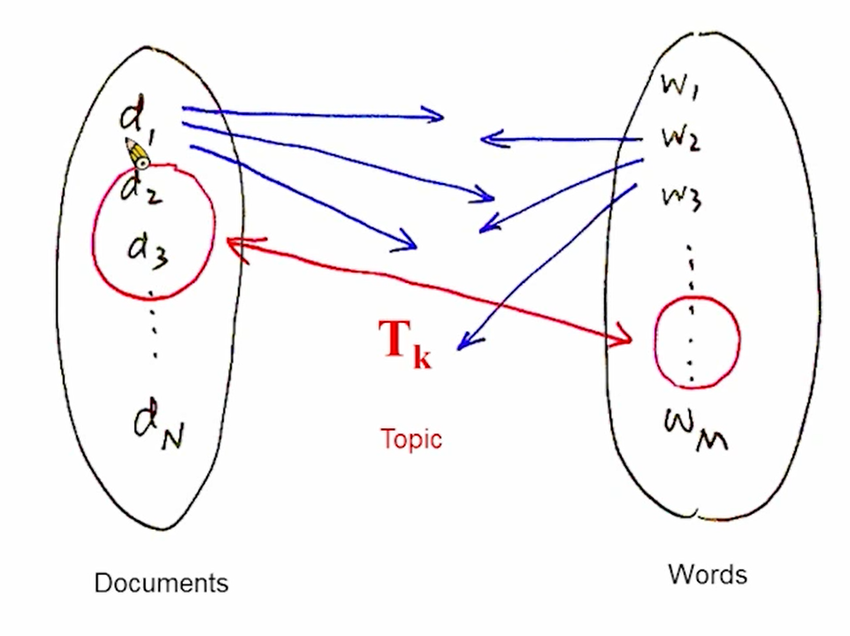

# 14-Linguistic Processing and Latent Topic Analysis

希望每个人有自己的language model，包括这个人的偏好。

根据主题做language model，每个人有自己偏好的主题。主题可以分得有粗有细。

要先知道语音的主题，才能训练language model。

key：如何让机器分析得到主题并建立相关的language model

# Latent Semantic Analysis(LSA)

**最早最经典的方法，word-document matrix representation**

latent topic：潜藏的主题，因为机器读到语音的时候不知道讲的主题，但是人读到的时候知道讲的主题是什么。

根据统计分析对topic进行分析

文章和词做一个matrix，值是词在文章中出现的次数。如果有词出现在相同的文章里很多次，表明这两个词很相似。

更好的做法：出现的次数和文章的词数normalization，因为有的文章会非常长，所以归一化更好体现特征。还要和所有文章中这个词出现的次数做归一化，因为可能有一些在所有文章中出现的高频词汇，比如英文的the，中文”的“。entropy也可以判断出这些不重要的词汇，乘一个normalize entropy。

每一行都像是一个特征向量，用来描述这个词

每一列也是一个特征向量，描述这篇文章的特征

文章和词对应的matrix大部分情况下不是方阵，方阵才能求特征值和特征向量，怎么把非方阵转成方阵求eigovoice？

转置之后再相乘就得到方阵，每个元素是词语之间的相似度

15的29：59

#