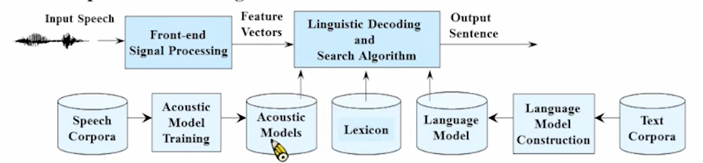

# 02-Fundamental of Speech Recognition

1. Speech Recognition流程
    
    
    
2. 难点：为语音建模（Acoustic Model）
    - **HMM**（最成功的模型）
        
        80’s建成的模型
        
        
        
        State：发音过程中较平稳的信号作为一个状态，整个发音的过程就是在状态之间转换
        
        
        
        把一段语音信号转成一堆vector（observation sequence）
        
        信号之前的overlap是因为语音是在不断地转换，很难划分，为了捕捉到转换的细节（每个音可能会因为前后的音节不同而发生一些改变）
        
        state sequence：将一堆observation sequence归类到某一个状态，一个状态可能会对应很多个observation sequence，因为发音方式的不同导致同一个音会有很多组不同的特征向量
        
        
        
        
        
        - 衡量一个音发音的长短：根据转移概率，转移到原状态的概率高的时候证明这个音的发音时间会比较长
        - 语音状态转移的特点：Left-to-Right，只会从左向右跳，并且最多跳过一个状态（表示吞音），因此转移概率矩阵A只有主对角线和上三角一侧的两条对角线有值（因为不会往回跳所以下三角一定为0），其他值全为零。
        - 每一个状态会有一个分布b(o)，一个observation sequence$o_x$放到不同的分布里会有不同的概率（表示了这个特征向量最有可能对应的音节）。
        - HMM是双重随机过程
            
            
            
            - state之间转换的随机过程（描述时间上的变化）
            - 每一个state对应一个随机过程（具有自己的分布）
            
            输入的是特征向量，根据特征向量去确定目前是哪一个state，再根据目前的state去确定下一个转换的state；语音识别过程就是先确定目前是哪一个音，再根据这个音去确定下一个可能发出的音是什么。
            
            解释：
            
            1、每个桶里RGB颜色的球有自己的分布
            
            2、抽哪个桶是随机的
            
            3、假设观测到序列RGBGGBBGRRR……（这就是输入的语音序列）
            
            
            
        - 问题：每一个state的分布b(o)难以衡量。求分布b(o)是最麻烦的，因为如果输入的特征向量是39维的vector，b(o)的高斯均值为39维，协方差矩阵为39*39维。
            - 用**GMM(Gaussian Mixture Model)**去衡量（以一维为例）
                
                
                
                用很多个高斯分布去拟合b(o)的分布，每一个高斯分布有一个权重，由于整个分布b(o)的积分要为1，因此高斯分布权重之和为1。使用越多的高斯分布则拟合的精度越高。
                
                o是一个多维向量，因此用一个多维高斯分布去拟合
                
                
                
                
                
                
                
                最后一个协方差矩阵，不为对角阵证明两个高斯分布是相关的（二维上高斯分布不是垂直的，转了一个角度），x1上均值较高的高斯分布，对应的x2上的高斯分布均值也较高。
                
        - 说话时开头的音会有一个分布，即初始分布Π
        - **HMM的三个参数：**
            1. **转移概率矩阵A**
            2. **每个state的分布B**
            3. **初始概率Π**
        - HMM有三个待解决的问题
            - 给定观测到的序列和已知的模型，如何预测得到序列对应哪个模型？（识别问题）
            - 给定观测到的序列和已知的模型，如何将观测得到的序列归类到某个状态里？
            - 给定观测序列，如何得到模型最佳的参数？（训练问题）
            
            
            
        - 语音识别的过程中要为每一个识别的词建立一个HMM模型，一个词发音的过程中会存在多个音节的转换（state之间的转换）
            - e.g：语音识别0-9的数字
                - 为0-9每个数字的语音建立HMM模型
                - 采集0-9发音的数据集（假设每个数字对应1000个语音样本）
                - 训练机器计算出每个HMM模型的参数λ = （A、B、Π）
                - 未知语音（如7）输入，每个model都算一遍几率，几率最大的model就是对应识别出的数字
        
3. 前端信号处理过程
    
    **目的：模拟人耳（人耳感知频域）**
    
    - 时域到频域（傅里叶变换）
    
    
    
    傅里叶变换：时域信号是一个向量，可以拆到频域的基向量上，对应不同大小的分量。
    
    - 特征提取：FFT的点数（如512）到39维特征向量
        
        
        
        - 预加重：人耳对高频的信号敏感，机器采集的信号没那么敏感，使得机器更好处理
            
            相当于将信号通过一个HPF
            
            
            
        - 检测终点（检测人说话的信号，去除噪声）
            - 短时能量
                
                
                
                求语音信号的短时能量，信号幅值平方加窗求和得到短时能量
                
                设定一个阈值，高于这个阈值就证明有人说话的信号，更好的方案是设定一个adaptive threshold
                
        - MFCC
            
            
            
            Mel-Scale：人耳越高频分辨率越粗糙，在高频取log
            
            Delta Coefficients：MFCC得到13个参数
            
            
            
            1-13: 原系数 ；14-26：一次微分 ；27-39：两次微分（表示口型的变化)
            
4. 语言模型
    
    
    
    判断句子：计算这n个词语组成一个句子的几率有多大
    
    问题：语言中的常用词非常多，组合数非常大
    
    假设：只算固定长度词语相连（N-gram）
    
    
    
    最常用的模型：tri-gram
    
    e.g.:
    
    
    
5. LVCSR
    
    输入语音信号$\overline{X}$，我们希望得到输出为一串词语$W'$
    
    
    
    Acousitc model：语音
    
    Lexicon：语音组成词
    
    Language Model：词语组成句子
    
    方法：算给出语音特征向量对应的词语序列的概率 → 利用贝叶斯公式
    
    
    
    由HMM和language model计算概率最大值
    
    - MAP（Maximum A Posteriori Principle）:
        
        
        
        E.G.要根据当天的天气情况x，推导后一天是w1/w2/w3天气的概率
        
        likelihood：曾经已知的天气w1/w2/w3情况下，前一天天气情况是什么出现的概率
        
        prior probability：出现w1/w2/w3天气的概率
        
        posteriori probability：有当前输入时的概率
        
        根据曾经的数据统计可以得到likelihood，要看哪个天气出来的概率最大只用比较likelihood×prior probability
        
        **对应到语音识别中，likelihood就是声学模型，prior probability就是语言模型。**
        
        先验概率：我已经知道了现在这个词/音后面接不同词/音的概率
        
        似然函数：目前观测序列属于哪个词/音的概率
        
        后验概率：目前观测序列后面应该接哪个词/音？
        
6. 例子
    
    
    
    syllable：音节
    
    图上有很多未知长度的音节
    
    word：可能不同的音节组合可以得到不同的word
    
    使用MAP原则和建立的模型计算得到句子的概率
    
    第一个音节确定了，相应的第二个音节起始位置就确定了。词典决定了那些字可以连起来组成一个词。由于不确定性，会有多条路径，这时候语言模型就发挥作用，哪些词串起来会更像一句话。