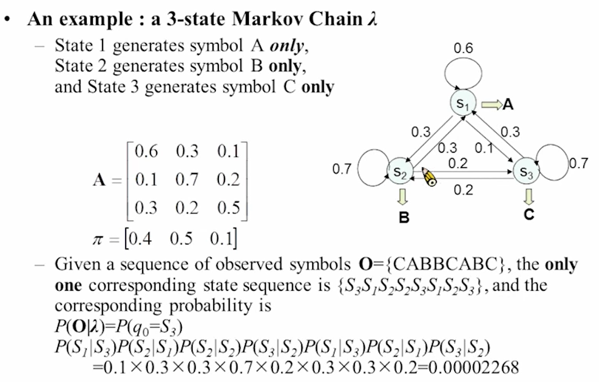

# 04-More about Hidden Markov Models

# Markov Chain

一般的马尔科夫链：每两个状态之间可以互相转换，**每个状态产生的序列是确定的**

一阶马尔可夫链：当前状态只和前一个状态有关

二阶马尔科夫链：当前状态只和前两个状态有关

# Hidden Markov Model

每个状态内还有自己的分布，一个state产生不同的序列有不同的概率，换句话说就是每个state的观测值是不确定的，观测值和状态无法互相对应，知道观测值不能确定状态，知道状态也没法确定观测值。

## HMM Type

根据状态的分布函数是连续还是离散进行区分

- Discrete
    
    减小计算量，不需要高斯进行近似
    
- Continuous
    
    现在都用Continuous，具体表现在每个状态的分布函数用GMM去近似
    

## Three Basic Problems

假设给出观测序列和隐马尔科夫模型

$\overline{O} = (o_1, o_2, o_3,...,o_t);\lambda = (A, B, \pi)$

1. 求在马尔可夫模型$\lambda$中得到观测序列$\overline{O}$的概率
2. 如何将观测序列$\overline{O}$归类到最合适的state中？
3. 给定一系列的观测序列$\overline{O}$，如何训练得到HMM模型$\lambda = (A, B, \pi)$，使得HMM模型中观测到序列$\overline{O}$的概率最大？

---

### 问题一：求在马尔可夫模型$\lambda$中得到观测序列$\overline{O}$的概率

- 可以用穷举法去计算这个概率，T为时间，N为状态

*计算量非常大，因为T值很大，一共需要计算$N^T$次。

- **Forward Algorithm**
    
    
    
    横轴代表时间，纵轴代表状态
    
    $o_1$最初始的状态可以是1，2，3，……，N，对应的状态分布就是$\pi$。
    
    在状态转移图中走过的path就是对应的state sequence（理解：由于隐马尔科夫模型中，每个状态观测到对应的观测序列$\overline{O}$不是确定的，有自己的概率分布，因此得到观测序列$\overline{O}$的时候可能是在不同的状态转换path中得到的，
    
    FA算法：引入一个新的变量$\alpha_t(i)$
    
    
    
    $\alpha_t(i)$表示在时刻$t$，状态是$i$的所有path概率的总和。
    
    Forward Algorithm只要将所有的$\alpha_t(i)$计算出来就可以，计算量减少到$NT$。根据时刻$t$的$\alpha_t(i)$，就可以计算出时刻$t+1$的$\alpha_{t+1}(j)$
    
    
    
    最后一列的值全部加起来就得到了$P(\overline{O}|\lambda)$。
    

---

### 问题2：如何将观测序列$\overline{O}$归类到最合适的state中？

- **Backward Algotithm**
    
    和Forward Algorithm类似，只是算向后转换的概率（注意不包括t时刻的点），引入变量$\beta_t(i)$。
    
    
    
    从后往前算，最后一列最好算
    
    
    
    从前面的点跳进后面黑色框的概率求和（先从前面的点跳进t+1的所有状态，再从t+1进入黑色框）
    
    **假设最后一列全是1**：${\beta}_T(i) = 1$，
    
    代入$\beta_{T-1}(i) = \sum_{j=1}^{N}a_{ij}b_{j}(o_{t+1})\beta_{t+1}(j) = \sum_{j=1}^{N}a_{ij}b_{j}(o_{t+1})$，
    
    满足条件，因此可以假设最后一列全是1
    
- 结合前/后向算法：
    
    
    
    含义：前往后走的path随意，后往前走的path也随意，但是在t时刻的状态必须是i
    
    
    
    ***A与B互相独立在人的语音中假设不成立**
    
    把$\alpha_t(i)\beta_t(i)$的乘积在坐标系$(t,i)$里写成一个表，那么这个表具有以下的性质：
    
    
    
    - 把任何一列加起来都是$P(\overline{O}|\lambda)$，但在最后一列AB独立的假设是成立的（最后一列t = T，$\beta$ = 1，简化成了问题一的结果。
    - 在每个时间t上，每一列都有一个最大的概率值，对应状态i，整个时间t历程里，状态i的集合就是最应该走的path，即最合适的state sequence。
        
        
        
        也可以把数值归一化，这样每一列加起来都是1。
        
        问题：
        
        1. 每一个时刻几率是独立求的，但是在t时刻转移到t+1时刻的转移概率可能非常小，因此并不是最佳路径。
        2. 在combine的算法中假设前后是完全独立的，但在语音中前后不是完全独立的

- **Viterbi Algorithm**
    
    
    
    走到点$(t,i)$几率最大的路径的概率为$\delta_t(i)$，每一个点都有一条走到那个点的最大几率的路径。
    
    也把这个几率列成一个表：
    
    
    
    做backtracking：记住当前状态的最佳路径是由前面状态的哪一个点跳过来的
    
    
    
    从最后一列的最大几率的点$P^*$往回backtracking到最开头，就得到最佳的path（state sequence），这样每个状态的最佳不是独立求解的。
    
    - Viterbi Algorithm的数学表示：
    
    
    
    Viterbi Algorithm不仅得到了最佳路径，也得到了最大的概率
    
    Viterbi Algorithm的一个例子：
    
    辨认0-9数字：
    
    既可以用Forward Algorithm，也可以用Viterbi Algorithm
    
    
    

---

### 问题3（最难的问题）：怎么训练得到HMM模型的参数？

- **Baum-Welch Algorithm（Forward-backward Algorithm）**
    
    **从Initial model训练出较好的模型，训练的过程：算出$a_{ij}$、$b_j(k)$、$\pi_i$的值。**
    
    
    
    训练过程的关键：先粗调initial model，再细调model。选择一个好的起始模型，最终的模型更容易收敛到最优解，否则会收敛到局部最优解。
    
    
    
    1. 调参数的过程（更新$**a_{ij}$、$b_j(k)$、$\pi_i$）**
    - 求$**a_{ij}$的值**
        
        
        
        
        
        分母：把所有的i和j都加起来。
        
        $\epsilon$的含义：算t时刻的状态是i，t+1时刻的状态是j的概率。
        
        问题2算$\gamma$，求t时刻状态时i的概率。和问题2的区别在于，$\alpha  \beta$的下标不一样，中间连不起来。
        
        **分子的表达式把back和forward连起来，增加了$\alpha_{ij}b_j(o_{t+1})$这一项把前后连起来。**
        
        
        
        例子：假设时间T向量有70个
        
        
        
        对于每一个状态i，都可以求出一个$\gamma_t(i)$值来
        
        在计算的过程中，从$t = 0$ 走到$t = T$，从$n = 0$到$n = i ,j ,N$，路径应该是沿着对角线的概率比较大，因此在图中部的点上，$\gamma_t(i)$的值会比较大。
        
    - 求$b_j(k)$的值（难点：因为它是用高斯分布近似的，参数非常多）
        
        
        
        定义新的参数$\gamma_t(j, k)$
        
        
        
        $\gamma_t(j, k) = \gamma_t(j) * 第K个高斯分布的权重占比$。
        
        以上图拟合的分布为例，某点对应的总的分布的值为分母，此点对应的第k个高斯分布的值为分子，两者相除就得到了第k个高斯分布的权重占比。
        
        求$b_j(k)$就是要求得GMM近似的高斯分布的均值和协方差矩阵。
        
        
        
        1. 获得最初的模型Initial Model
            1. 基础知识
                - Vector Quantization，矢量量化
                    - VQ的原则：
                        - error sensitivity：在信号比较大的时候是可以容忍相对来说比较大的量化误差的，信号比较小的时候是只能容忍小一些的量化误差。因此量化的值不一定要取在中间，也不一定要均匀分配量化区间。
                        - probability distribution of x(n)，也就是在密度比较大的时候为了使量化误差尽可能小，信号密度比较大的区域给分配的量化间隔小一些。
                    - VQ的过程也可以看成一个聚类（cluster）的过程，将几个点聚类到一起，寻找他们的boundaries。
                    - VQ用于分群（cluster），分群通常有以下几个算法：
                    
                    
                    
                - K-Means Algorithm
                    
                    迭代以下的过程：
                    
                    - 固定代表值找边界
                    - 固定边界找代表值
                        
                        
                        
                    
                    问题：
                    
                    初始条件怎么设置？怎样保证收敛到全局最优？
                    
                    
                    
                    - LBG Algorithm（K-means Algorithm的改进版）
                        
                        
                        
                        先假设分类数L = 1，代表值就是求平均值。再对平均值进行微小的移动，分开成为两个代表值。循环以上的过程，就可以实现分类。
                        
            2. 初始模型的**训练方法：segmental k-means**
                1. 对于不同长度的语音，先四等分，每个部分都拿来训练不同的state。
                    
                    
                    
                2. 每段的数据训练得到对应state的高斯分布的协方差矩阵和均值，得到$b_j(o)$.
                3. 对每一个state做VQ，假设训练过程中迭代了N次，一个state会得到$2^N$个高斯模型
                4. 假设$A_{ij}$都等于0.5，$\pi$ = （1，0，0，……，0），对模型跑一次Viterbi Algorithm再对语音进行不同的划分（VA的目的是找到将每帧划分进最合适的state的方案），计算概率P，迭代这个过程，达到P收敛，这个模型就是最开始的起始模型
                
                