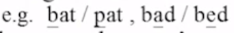

# 05-Acoustic Modeling

# HMM模型单元的选择

1. 语音的单位
    
    phrases, words, syllables, phonemes
    
    phoneme是指语言中最小单位的音，互相之间可以区分
    
    phone是指phoneme的具体实现
    
    e.g.
    
    
    
    - Phoneme之间的影响关系：
        
        
        
        发音受到前后单元的影响，对于词组来说，词与词之间也会有影响（intraword/interword）。
        
        - intraword：只考虑单个词内音节之间的影响
        - interword：考虑词汇之间发音的影响
        - RCD：右边接的音节不一样，就看作不一样的单元
        - LCD：左边接的音节不一样，就看做不一样的单元
        
        Madarin的syllable：一字一音，一音多字/一字多音，每个字的发音就是一个syllable
        
        syllable和character之间的mapping关系是非常复杂的
        
2. 选择的原则
    1. 准确性
        
        单位越大越好，但是数据量要求非常大
        
    2. 可训练性
        
        单位越大，数据量要求大，训练难度就大幅度提高
        
    3. 泛化能力
        
        希望根据已有的词就可以识别新词 → 单位越小越好
        
    
    
    
3. 目前最常用的单位：**Triphone**，在上述三个原则之间的折衷
    
    假设有60个phoneme，则Triphone就有$(60)^3$个，数目太大，很难训练。需要在准确性和可训练性之间折衷 → sharing
    
    
    

# Triphone模型的训练

- 信息论基础
    
    信息源是：
    
    
    
    那么信息量$I(x_i)$应该具有以下四个特性：
    
    1. 非负性
    2. 出现的概率趋近于1，信息量趋近于0.（确定的事件不具有信息量）
    3. 信息量越大，出现的概率越小
    4. 信息量是可加的。e.g. 2bit数据的信息量等于分别求其中1bit的信息量再加起来
    
    
    
    信息熵：$H(S)$，entropy
    
    
    
    假设有三个变量：信息熵最高点在三个变量出现概率相同的时候
    
    
    
    不确定性最高的时候所带的信息量最大。
    
    两个有关定理：                                         
    
    - Jensen’s Inequality
        
        $-\sum_{i=1}^M p(x_i)log[p(x_i)] \leq -\sum_{i=1}^Mp(x_i)log[q_(x_i)]$
        
    - Kullback-Leibler Distance(KL Divergence)：计算两个概率分布之间的距离。
        
        当两个分布之间越相似，KL散度越小。
        
        $D[p(x)||q(x)] = \sum_ip(x_i)log(\frac{p(x_i)} {q(x_i)}] \geq 0$
        
        注意：这个距离是不对称的
        
- Classification and Regression Trees(CART)
    
    例子：要给许多人按身高分类，但是没有身高的数据
    
    
    
    先找一堆已知身高的人，根据他们的情况建立该问的问题以及阈值，建立一棵树，来预测其他人的身高。
    
    怎么保证区分度较好？计算每个node的entropy，希望每一次划分的时候，entropy降低的量最多→ 表示区分的效果最好
    
    
    
    
    

## 用CART训练Triphone的HMM模型，实现模型的sharing

中间的phone是一样的，拆开每一个state，每个state做一个tree

以第一个state为例，最后两个phone是一样的，可以共用。分得越细，Question越多。

共用的关系由tree体现。

假设过来一个未知的triphone，在树里也可以找到位置。data-driven & knowledge-driven

## 对于中文识别的分析

- Mandarin Syllables（上述的理论针对所有的语言）
    
    
    
    
    
    21个声母对应22个模型（空声母，比如艾没有声母）
    
    实践中发现中文使用phoneme为单元更好
    
    
    
    triphone复杂度最高，但是效果也比较好。
    
    - 不同单元的正确率
    
    