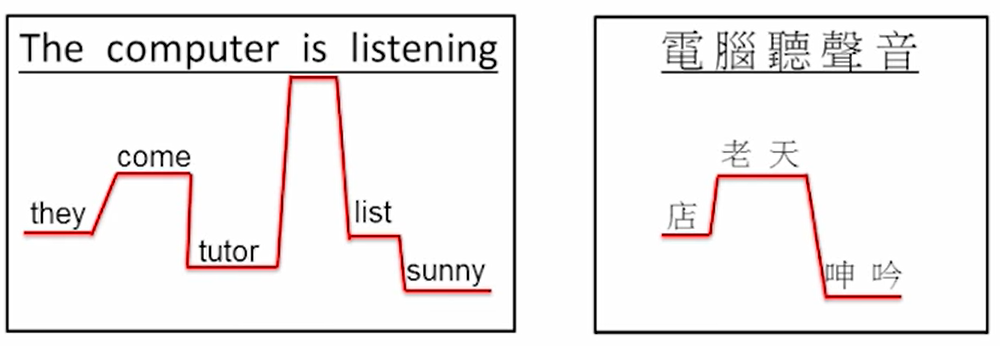

# 06-Language Model

1. Language Modeling: providing linguistic constraints to help the selection of correct words.
    
    e.g.声音可能对应不同的词，语言模型帮助我们选择最通顺的句子
    
    
    
2. 语言携带的信息量
    
    entropy：
    
    $0 \leq H(S) \leq logM$.
    
    English：
    
    以英文26个大小写字母为例，最大的信息量为6bit。
    
    如果字母构成词，大概有30000个词，每个词的信息量为15bit。
    
    Mandarin：
    
    
    
3. Entropy & Perplexity
    
    
    
    假设6万个词语，但每个词语出现的几率各不相同。
    
    w1可以选择更常用的词，w2根据bi-gram，选择可能和w1相连概率高的词；w3根据tri-gram。
    
    w1有6万种可能，如果它的entropy是10bit，可以假设w1对应的词典是一个1024词（perplexity），相同概率的词典（保证entropy相同，但是词汇量大大减小）。根据bi-gram，w2现在的entropy是9bit，所以对应的词典是512词。
    
    
    
    **-Language Model简化了选择的复杂程度。**
    
    
    
    对每个词选词的难度做一个平均（几何平均），再求倒数，得到312 → 表示每一次都在312个词的虚拟词典里选词。
    
    - 评判Language Model的标准：Perplexity，使用一个测试集D去测试，测试集上Perplexity的值越小，表明模型的泛化能力越强；训练集上Perplexity的值越小，表明模型与训练数据的匹配程度越高。
        
        
        
        测试集每个句子都算选词的难度，对于每个句子来说，第一个词是Uni-gram，第二个词是Bi-gram，第三个词及以后是Tri-gram。
        
        在测试集上算出平均选词的难度，越小越好。→ 泛化能力越强
        
        
        
        Language Model就是计算出Uni-gram、Bi-gram、Tri-gram的几率。
        
        例子：对于每一个特殊的领域，train一个Language Model，蓝色为把所有的数据集合并在一起评估得到的perplexity，灰色为在特定领域测试评估得到的perplexity。
        
        
        
        training database越小，应该模型的表现较差（perplexity较高）。但体育模型的语言结构比较单纯，在较小的训练集上表现也比较好。
        
        可以看出针对特定的领域train LM效果更好。
        
    - Cross-Entropy
        
        KL divergence也可以叫做Cross-Entropy，根据jensen不等式，交叉熵比信息熵要大。红色框是测试集上出现的概率，蓝色框是训练集得到的统计
        
        
        
        Training corpus和Test corpus之间的概率不一样
        
4. Smoothing of Language Model
    - Data Sparseness
        
        如果有句子从来没有在训练集中出现过，那么在识别的时候，这个句子永远识别不出来（train时得到两个词语相连的几率为0）。
        
    - Smoothing(For Unseen Events)
        
        给发生概率为0的事件一个较小的概率，让他可以发生。但总几率大于0，要把较高概率的事件的概率分一点到概率为0的事件。
        
        - Add-one Smoothing
            
            给每一个事件发生的概率加一
            
        - Back-off Smoothing
            
            n-gram退化到(n-1)-gram
            
            原理：uni-gram出现的概率比较大的情况下，bi-gram出现的概率也会比较大。
            
            没出现过的n-gram，可以用出现过的(n-1)-gram乘以一个权重去预测。
            
            
            
        - Interpolation Smoothing
            
            
            
            把一个数据量小的special model和一个background的model之间做一个平均，可以调整b值使他们的权重不同，达到提高special model的效果的目的。
            
        - Good-Turing Smoothing
            
            
            
            比如从海里抓到18条鱼，共6种，但海里有1000种鱼，用较少的样本去估计其他种类的鱼。把只出现一次的鱼的几率作为unseen的几率，为3/18，平均到未知的994种上去。
            
            | 次数 | 出现该次数的event数 |  | 几率 | 出现该次数的event数 |
            | --- | --- | --- | --- | --- |
            | 0 | 994 |  | (3/18)/994 | 994 |
            | 1 | 3 | →good-tuned | 2/18/3 | 3 |
            | 2 | 1 |  | 3/18/1 | 1 |
            | 3 | 1 |  | 10/18/1 | 1 |
            | 10 | 1 |  | ? | ? |
            
            一般来说，就是把只出现一次的事件的几率平分给出现0次的N个事件，把出现两次的事件概率均分给出现1次的M个事件。
            
            数学表达：
            
            
            
            把r替换成r*，总和的观测次数N不变
            
            问题：
            
            1、最高几率的event送给了别的event，其几率不是最高的
            
            2、unseen的概率都是一样的
            
        - Katz Smoothing
            
            
            
            解决Good-Turing问题1：
            
            -多于阈值出现次数的事件就不修改他出现的次数，只改变出现次数较低的不重要的事件。
            
            -每个事件出现的次数都打一个折扣，把折扣下来出现的次数送给出现次数为0的事件。
            
            解决Good-Turing问题2：
            
            -back-off：没见过的bi-gram就用uni-gram来算，没见过的tri-gram就用bi-gram来算，往后退一阶，用那一阶的概率为依据，将几率非平均分配给未出现的事件。
            
            
            
5. Class-based Language Modeling
    
    
    
    word class：词群，比如人名都是一个词群。用词群的概率代替词的几率
    
    Language Model从词的n-gram变成词群的n-gram。
    
    具有smoothing的效果：训练数据种没有的词汇也可以识别了（比如一个从来没见过的人名）。
    
    两者结合：几率高的词语用word，几率低的词语用class.
    
    例子：买飞机票
    
    
    
    航空公司、地名、日期作为词群，剩下的句式是非常固定的。当出现新的词的时候就人工加入词群。
    
    - 难点：怎么分词群？（Data-Driven & Knowledge-Driven)
        
        e.g.1：先把所有词作为一群，迭代中分群，根据perplexity降低最多的情况作为一个词群。
        
        e.g.2：CART，把word的历史做成一个树，根据这个树分群（比如问是不是名词，是什么性质的名词）
        
        
        
    1. Class-based Chinese Language Model
        
        中文的LM和英文的LM差别较大，但AM相似。
        
        1. 分群
            
            
            
            POS：Part of Speech, 词类。
            
            先根据人类的知识分类（Knowledge-Driven），再根据数据进一步区分（Data-Driven）。
            
            
            
            比如现在有6万个词汇，列出每个词汇后跟的词出现次数的表，再根据K-means对这些词汇进行分群。
            
            最后再根据人类的知识，将部分class merge起来，起到smoothing的效果。
            
            高频词汇用data-driven的方法就可以分的很好，但是低频词需要用knowledge-driven的方法补足。
            
        2. 中文结构特征
            - 字和词的意思可以相关也可以完全不相关，比如电脑/大学
            - 英文词与词之间有空格作为分隔符，但是中文没有；并且词语之间的边界可以有多种划分，没有一个明确的词典。
            - 词汇灵活性非常强
                
                
                
            - OOV(out-of-vocabulary) problem
                
                不在词典里的词无法处理，中文尤其多。
                
        3. word-basd LM & character-based LM
            
            
            
            word-based：高频出现的OOV断成单字词
            
            也可以做成完全data-driven的词典：几个经常一起出现的字就作为一个词典，最小化perplexity
            
            
            
            举例：
            
            