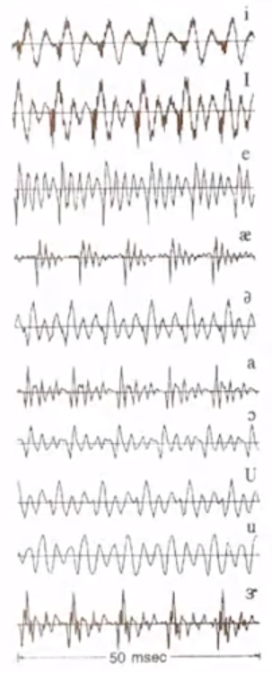

# 07-Speech Signal and Front-end Processing

1. 语音信号
    
    **浊音(voiced)是周期的**，将这个周期的倒数作为音高。
    
    $F_0 = 1/pitch$.
    
    pitch与音调是相关的，会发现一声的周期基本是不改变的，二声的周期会变短，四声的周期会变长。
    
    **清音(unvoiced)是非周期的**（区别在于声带有没有在震动）。
    
    **其中，声门震动的快慢，决定声音的基本频率(即音高)；口腔、鼻腔、舌头的位置、嘴型等，决定声音的内容(即音色)，肺部压缩空气力量的大小，决定音量。基音频率体现的是声源的信息，而共振峰体现的是声道的信息。**
    
    
    
2. 时域 & 频域
    
    Voiced信号和Unvoice信号在频域
    
    
    
    | voiced | unvoiced |
    | --- | --- |
    | 频域在前半段是周期的，周期是音高(pitch) | 频域非周期 |
    | 在低频幅度比较大 | 在中频幅度比较大 |
    
    Fomat Structure，共振峰：包络（曲线平滑的形状，去掉毛刺）上的峰值。
    
    由Format Structure的频率体现每个音的特点。
    
    
    
    频域乘积等于时域卷积，口腔对于声音的影响可以看作卷积，平滑曲线（Fomat Structure）和毛刺相乘就得到了频域的特性。
    
    
    
    分析语音信号：
    
    
    
    - 取一个小的window
    - 每一个window做FFT（Short-time Fourier Transform)
    - 把每个window的值画到图里
    
    ### **Spectrogram（语谱图）**
    
    
    
    中间幅度比较大的有周期性的就是元音(Voiced)，对于每个window做FFT得到上面的图，Unvoiced的频率较高，Voiced的频率较低。
    
    ### Format Frequencies（共振峰）
    
    
    
    Spectrogram中颜色较深的地方对应的就是Format Frequency。Format Frequency有助于区分不同的音。
    
    e.g.4根曲线是F1/F2/F3/F4
    
    
    
3. 语音信号建模
    
    
    
    Ex产生的信号u经过口腔G的作用变成x，只要有这些模型的参数就可以变换和复原信号。
    
    Voiced信号是周期的，需要知道他的周期，H(Z)表征口腔的影响。
    
    
    
    
    
    G(z)的参数就是$a_k$
    
4. MFCC (Feature Extraction)
    
    
    
    - Pre-emphasis
        
        相当于一个高通滤波器，$H(z) = 1 - \alpha Z^{-1}$. Voiced的声音在高频幅度比较小。人的声音在高频大概20dB/decade
        
    - Window（Frame Length & Overlap)
        
        Frame Length：做短时傅里叶变换，太短的变换捕捉不到特征，太长的变换把很多声音都平均了。
        
        Overlap：捕捉Smooth变化的特性
        
        这两个参数决定了计算量。
        
        问题：取window会导致信号变化，FFT后的结果会不同。
        
        
        
        时域的乘积等于频域的卷积，以矩形窗为例，频域是Sinc函数，取log函数，Side lobes变大。
        
        
        
        Main lobes：把信号在频域变得更宽，难以捕捉到特性
        
        Side lobes：使得energy在频谱上搬移
        
        希望window的特性：main lobes越窄越好，这样会提高分辨率；side lobes越小越好，减小频谱拖尾（频谱泄露）。
        
        这两个特性之间需要tradeoff
        
        比较好的窗函数：Hamming window（side lobs比较窄）
        
    - DFT
    - Mel-filter-bank（模拟人耳的听觉）
        
        
        
        人耳大概可以听到24个mel-filter
        
    - $log^2$求能量，模拟人的感受
        
        绝对值：去掉相位信息（人耳对相位不敏感）
        
        求对数：人耳的感知是对数
        
        取对数后可以去掉频谱上的毛刺U(ω)。
        
        
        
    - IDFT（Inverse DFT，这里也可以做DCT变换）
        
        不做IDFT/DCT变换输出的就是FBank特征。
        
        
        
        log能量谱是实对称的，DCT变换后的信息是不相关的。
        
        输入到HMM-GMM模型中，GMM的协方差矩阵可以看作对角阵。
        
        
        
        声音的特征由频域上的包络和共振峰表征，因此希望尽可能去除频域上的毛刺。
        
        IDFT把频谱上的毛刺（高频的）和Format Frequency（低频的）分开。MFCC取前面的十三维向量，就是Format Frequency。
        
        IDFT：spectrum → cepstrum
        
    - derivatives
        
        Why derivatives?
        
        1. 信号传输过程中会引入卷积噪声，经过MFCC处理后卷积噪声变成加性噪声，噪声可以看作直流（变化不大）。微分可以去掉直流分量，去除噪声
        2. 捕捉到信号中变化剧烈的部分
        - 一次微分
            
            linear regression：用直线去近似一堆点，所有点到直线的距离之和最小。
            
            用向量的每一个点做线性回归，求一阶微分
            
        - 二次微分
            
            用一次微分的每一个点做线性回归，求二阶微分
            
5. 端点检测
    
    没有在说话的时候成为silence，此时还有noise。
    
    
    
    - 将噪声识别成语音：false acceptance
    - 将语音识别成噪声：false rejection
    
    语音识别时希望有较低的rejection rate →push to talk/threshold/建立silence的模型/在silence和speech之间自动切换
    
    