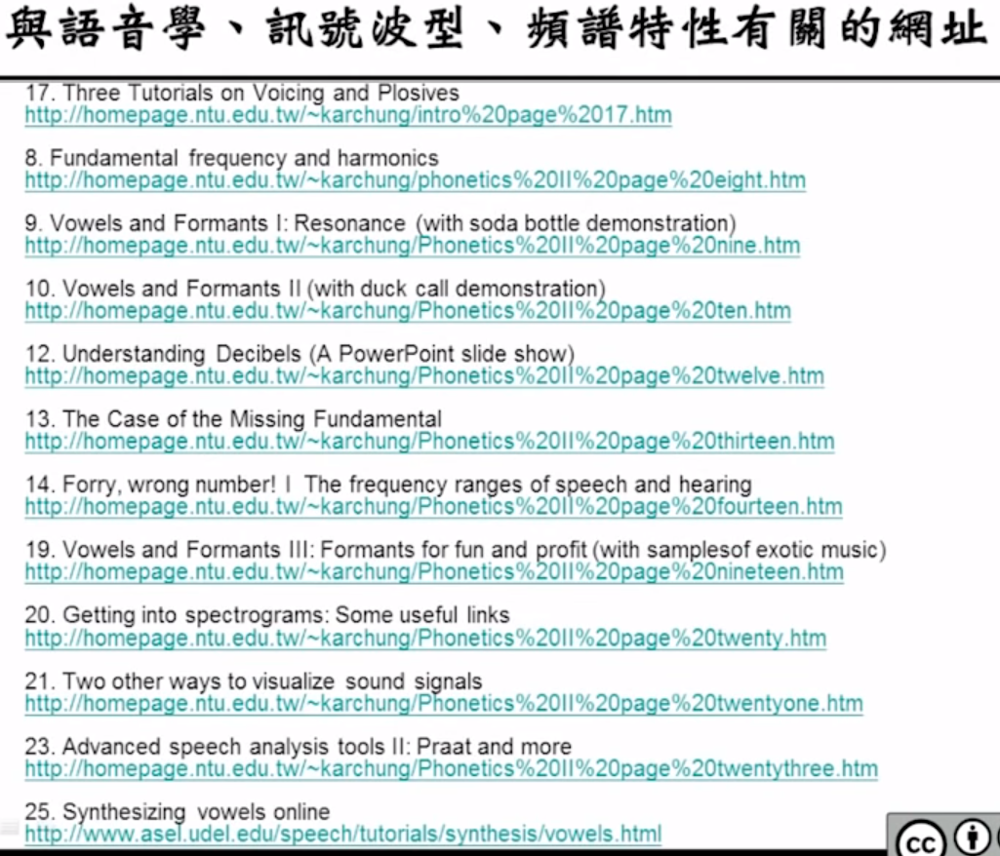

# 08-Search Algorithms for Speech Recognition

# Dynamic Time Warping and Dynamic Programming

## DTW（早期的识别方法）

把两段声音进行比对，在比对的过程中会出现语音信号的长度不一样长等情况。

假设图里坐标轴上的值是MFCC特征的第一维，画在一个曲线里

每一个点的横纵轴对应一个MFCC的vector，两个轴都是可以伸缩的，横着不走竖着走，表示ref的语音比test的语音短（test的好几个状态才对应ref的一个状态）；竖着不走横着走，表示ref的语音比test的语音长（ref过了好几个状态，test还在一个状态上）

**这条path就可以实现不等长的语音序列的对齐，再计算它们之间的相似程度（距离）。**

横轴上有M个MFCC的vector，表示reference的声音特征；纵轴上有N个MFCC的vector，表示test的声音特征。整个路径上共有L个离散的点。

目标：分别找到x轴和y轴和L点对应的函数

限制条件：都要从头走到尾，并且只能往前走（或是停住不动）

1. $f_x(1) = 1, f_y(1) = 1$.
2. $f_x(L) = M, f_y(L) = N$.
3. $f_x(m+1) \geq f_x(m), f_y(m+1) \geq f_y(m)$.
4. 也可以自己加constriant，global/local

算法（类似viterbi算法）：

1. 为每一点定义一个D，D表示到（i，j）的最小距离
2. $D(i,j) = min\lbrace D(i',j') + \overline{d}[(i',j');(i,j)]\rbrace$，$D(i',j')$是前面走到$(i',j')$这一点的距离之和，$\overline{d}$是从$(i',j')$这一点走到$(i,j)$点的最小距离。（这个距离可以自己设定，不局限于算法）
    
    
    
3. 和viterbi不一样的是路径可以斜着走，多跨过一个

特点：

1. Distance表征两个声音的相似性
2. DTW无法处理大词汇量的任务，只能做小词汇量的任务
3. 也可以做特征词提取
4. 但是没有好的方法去训练model（没有model）

## DP

把很大的任务分成小任务，用迭代的方式求得sub-problem的解

# CSR

## 数字辨识

难点：不知道念的数字有多长

假设每个数字的model是一个平面，数字进来可以从一个平面从头走到顶，再从下一个平面从头开始走，循环求概率就可以识别出

错误率的计算：

中文比英文难的地方：无法分辨数字的边界，造成重叠或者删除。

怎么做Alignment？DTW

知道念的数字有多长：假设有四个数字，每个数字走10个平面，并行进行。

# LVCSR（难点）

问题：不知道音之间的边界，也不知道词之间的边界。

- MAP原则计算（*计算量太大）：
    
    观测到的语音，计算句子出现的概率，选择概率最大的句子作为识别结果。
    
- Viterbi Research（Dynamic Programming）：
    
    做近似，不把所有的句子出现的概率都算一遍，如果某个state sequence的概率最高，就把它作为识别的结果。→ 有可能找到的是局部最优
    
- Tree Lexicon
    
    将词语建成一个树，走到最后就是一个word
    
    
    
    效果：HMM变成树状，搜寻的过程可以共用，搜寻的空间变小
    
    
    
    问题：但是在词汇识别已经有一个很大的tree了，在句子很长的时候复杂程度太高。
    
    ## Viterbi search
    
    定义$D(t,q_t,w)$是在时间t时，在词汇w中的qt状态（一个词汇对应多个状态）
    
    定义$h(t,q_t,w)$是在时间t时，在词汇w中的qt状态的前一个状态（back track）
    
    句子识别时有两种状态，都用viterbi算法：
    
    1. intraword
        
        就是viterbi的HMM模型，没有语言模型。
        
        
        
        其中，$logp(o_t|q_t,w)$就是$logb_j(o_t)$，$logp(q_t|q_{t-1},w)$就是$loga_{ij}$。和Viterbi Algorithm的计算方法完全相同，只是在这里取了对数。
        
    2. interword
        
        只有语言模型，没有HMM（相当于Language Model把两个HMM连起来）
        
        
        
        在两个HMM之间加入一个空的状态Q，让他们更好的连接起来。把上一个HMM的最终状态作为qf。
        
        
        
        bi-gram，$logp(v|u)$：u后面接v的bi-gram，因为走到这个节点，现在还不知道后面的词语是w
        
        ### Beam Search
        
        在每个时间点只保留几个概率较高的path，其他path就丢掉。可以设定保留的path数目，保留的path数就是beam width；也可以设定一个Threshold，没到这个值的path就丢掉。
        
        ### Two-path Search/Multi-path
        
        分成两阶段来做，先用一个很粗糙的模型去算（tri-phone变成mono-phone，tri-gram变成uni-gram），在这个阶段算出来的概率很低的path就全部丢掉，将计算的范围缩小；第二阶段再用精细的模型去重新计算概率。
        
        
        
        第一阶段会得到一个Lattice
        
        
        
        先初筛出了这几个可能的答案，再给这些可能的答案做re-score，选出最可能的那个。
        
        问题：无法做到实时，因为要先处理初筛的这一步，但是user可能感觉不到是非实时的
        
    
    ## Search Algorithm Fundamentals
    
    例子：在城市中找路径最短的路，可以做成一个决策树。
    
    
    
    1. Blind search（不知道goal在哪里）
        1. depth-first
            
            每次随机选一条路
            
        2. Breath-first
            
            每次选最好的一条路
            
    2. Heurstic search（知道goal在哪里）
        
        不仅要在每一个node上找最好的路，还要估计目前到goal的距离（紫色的数字是到goal的估计距离）
        
        ### 在语音识别中的Heuristic Search
        
        问题：不知道goal
        
        
        
        每次估计goal就是估计到底的分数
        
        ### A* Search and Speech Recognition
        
        - admissibility
            
            如果一个算法第一次解出来的解就是全局最优解，那么可以将这个算法称为admissible。
            
        - Heuristic Search是一个admissible的算法
            
            
            
        - A* search
            
            Two-path配合A* search，会得到不错的结果
            
            