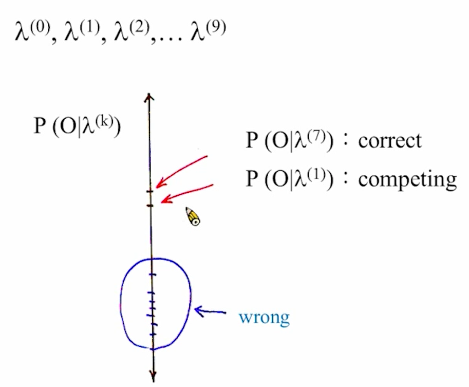

# 09-Speech Recognition Updates

介绍现在新的语音识别技术的发展，使用新的技术发展fundamental的技术

只会做一些简介

# Minimum-Classification-Error and Discriminative Training

HMM模型训练的核心就是希望最大化概率，但是没办法看到competing class的关系，也就是说辨别相似音的能力。HMM并没有处理相似Model（competing class），competing class构成confusing sets。

引入MCE解决相似

例子：数字识别7和1

假设用train data训练出来的state高斯模型如下图，此时输入的测试数据7刚好在交界的地方，但这个地方1state的概率比7state要大，造成识别错误。

当test data和train data的统计特性不太一样时，就会造成错误。数学描述：

可以在训练的过程中调节参数，将两个高斯分布拉的更开，更不容易混淆。

## MCE Training

做法：

看d的值，负的表示识别正确，正的表示识别错误

α → ∞，表示用最容易混淆的那个去和正确的答案去计算

定义损失函数：把刚才算出来的d放到损失函数里，负的变0，正的变1，相当于统计正确/错误的次数。

现在可以把所有的training data放到损失函数里，计算错了几次。训练的过程就是迭代调节$\lambda$，最小化损失函数的值。

优点:

training的过程中不用针对每个模型进行training，所有的模型一起训练。

### 梯度下降算法(Gradient Descent)

最小化损失函数，使用梯度下降算法。

现在需要找到一个a1的值，使得函数L值最小。a1就是需要调节的参数。

每个参数向它下降最快的方向去移动，用数学式表达：

$a_{t+1} = a_t - \epsilon_t \frac{\partial L(\Lambda)}{\partial a}$，$\epsilon_t$是学习率。

将参数集合成一个vector$\Lambda$，梯度下降算法可以表示为：

$\Lambda_{t+1} = \Lambda_t - \epsilon_t \nabla L(\Lambda_t)$.

**问题：可能走到局部最小，不是全局最小。**

## MPE Training for LVCSR

### Minimum Bayesian Risc

将辨识错误的Posterior probability和Loss function相乘，再加起来就是Bayesian Risc。

训练过程中就是减小BR的值

问题：

1. 太复杂，很难最小化BR
2. 定义损失函数很重要

最成功的方法：MPE，对每一种错误定义很细致的损失函数

例子：

另一种做法：feature-space MPE

不调模型参数，对于输入的MFCC特征做变换，使他们输入到模型中可以更好的被分开。

这种做法统称为Discriminative Training，通过鉴别的方法尽量把数据分开。

# Subspace Gaussian Mixture Model

想要对HMM模型精细化，希望对每一个状态使用更多的高斯模型去拟合，但是高斯模型变多之后，参数会变得非常多，难以去训练。

减少高斯的参数，使用Share的参数，去生成很多的高斯。

做法：

1. 每一个susbstate有一个参数vector，$v_m$.
2. 每一个substate里的第一个高斯分布，都共用参数M1（均值向量），某个substate里面的第一个高斯分布的均值向量$\mu_{mi} = M_iv_m$.
3. 协方差矩阵不乘每个substate的vector，只共享
4. weight

每个substate也都有自己的权重，这样可以拟合出每个state的分布。

# Neural Network（Multi-Layer Perceptron）

想用神经网络取代HMM，但效果始终没有HMM好，因此将两个模型结合。

DNN

### Multi-Dimensional Space

MFCC特征向量有39维，要在高维空间找一个**非线性函数**将它们分开来

神经网络（多层感知机）

每个神经元都有n个输入，产生一个输出，每个神经网络有一个激活函数，激活函数是非线性的。

训练方法：BP算法，因为从最后的error开始，去调节每层的权重

调节Weight可以用梯度下降算法

# Spectrogram

让机器去看语谱图，实现识别。

## Gabor Feature

用两个二维的filter去提取特征，数学表达

二维filter是高斯乘以sine函数，设定不同的参数就可以得到不同的filter，提取不同的特征。

## HMM & Neural Network

### Tandem System

把MFCC特征与Phone Posterior串在一起，输入到HMM，训练HMM模型

Phone Posterior是由MFCC特征输入到神经网络得到的输出（相当于MFCC通过NN做了一个变换）。

MLP：多层感知机

### Hybrid System

把HMM中每个state的分布，由高斯拟合替换成MLP（NN）得到的概率分布。

神经网络可以理解成将输入映射到输出的函数，state的分布是观测序列与概率的函数，因此可以用神经网络去拟合。

HMM每个state里面是一个DNN网络。但是这不代表说state里面的GMM就不用了，因为训练数据的MFCC特征对应的state还是需要高斯分布去拟合，给训练数据的MFCC特征标注state是人没有办法做到的，还是要用GMM模型。只是辨识的时候用DNN来做，Training还是要用原始模型来做。

理解：training data可以共享，得到自己的模型时就不用再考虑GMM了，可以直接training DNN得到state分布，减少了工作量。

# Deep Neural Network

有很多hidden layer的神经网络。每一层做一次运算就相当于做一个domain transform

困难:

参数多，训练难度大，容易收敛到局部最优解。因此需要选择一个好的initial model，不能随机化初始权重 

→ solution：RBM，受限玻尔兹曼机做初始化（2010，2011年）

## RBM

只有两层的神经网络

有v, h，就可以算出能量E，根据能量E可以算出概率p，目标就是调参数使得p最大。

特点：

1. 不需要label的数据，unsupervised
2. 可以用大量的未标注数据去训练

### RBM Initialization

**每层RBM训练出的权重W作为DNN连接的初始权重，再用已标注的数据在DNN里用BP算法训练。**

## Bottleneck Features from DNN

把DNN的某层缩小到一个较小维度的向量，用它作为新的特征来训练DNN模型，这个特征就叫做Bottleneck Feature，也可以取得较好的效果。

怎么完全抛弃HMM？可能需要很多的data，目前还没办法做到。

## Convolution Neural Network

在图像处理中取得较好的效果，也可以用作语音（识别语谱图）。

## Long Short-term Memory(LSTM)

将NN里面的cell复杂化，控制进来/出去的多少，现在新的cell就叫做LSTM

最后真正的输出是a，比神经网络多了四倍的参数

## NN Language Model

输入是一个一个word，输出是下一个word的几率

进来的word用N维向量编码（多少个词就多少维），输出也是N维

### RNNLM

输入还是N维向量，中间需要循环

Recursive：把上一次输出的向量和这次输入进来的结合，再输入到这一层，相当于考虑到前面词的影响，相当于n-gram

training的时候要把中间循环的部分展开

### Word Embedding

把输出的后面接的词的概率作为词语的特征向量，放到N维空间里

相似的词会聚类到一起，表明这个N维向量是有语义特征的

e.g.

(king) - (man) + (woman) = (queen)

衍生情形：

### Weighted Finite State Transducer(WFST)

Acceptor：判断哪一个序列是可以接受的

Transducer：不仅可以判断是否能接受，还可以输出

Weighted Finite State Machine：不仅可以接受，可以输出，每个状态还有概率

- operation
    - Composition（合成）
        
        
        
    - Minimization
    - Weight Pushing
        
        
        
    
    语音识别的过程就可以做成一个WFST，每个模型之间可以做Composition
    
    
    
    HMM模型是Transducer，输出是状态转移概率
    
    
    
    处理语言之间的相关性
    
    
    
    进入词典
    
    
    
    N-Gram
    
    
    
    可以有blank state，表示未出现的bi-gram
    
    把输入的语音也做成一个WFST，得到U
    
    frame：帧
    
    
    
    识别的过程就是U和识别模型的WFST做compose，就得到了识别结果。
    
    # Prosodic Features
    
    抑扬顿挫
    
    - pitch
        
        中文里声调比较重要，根据音高可以定义很多种特征
        
        
        
        - Random Forest分辨声调
            
            Random Forest是一堆决策树的集合，每棵树用training data的不同subset去训练，训练完后统计每个树的结果，最多的就是识别的结果
            
        - 除了Acoustic/language model，还可以建立Prosodic Model，三个模型之间可以定义权重。2个path是因为先有了word sequence的话判断音调比较好做。
            
            
            
    - pause
        
        中文里的停顿也有很多feature，停顿的长度，停顿的位置等等都是特征
        
        
        
    - Energy
    

# Personal Recognizer and Social Network

目前为每个人训练一个model是可行的，云端存储量和算力都足够。

AM：收集使用者的语音数据

LM：收集使用者的语言癖好，需要大量的文字，可以来源于social media

# Recognization Code-switched Speech

指识别语言切换

每个模型都需要做双语，frame输入的时候必须考虑两种情况，并且中文可以接英文，英文也可以接中文。

两者都需要比较大的数据

并且两个语言中相近的音，speaker可能会讲成一样，因此就无法识别

**Language Identificatio**n

可以每个frame算属于中文还是英文

中文和英文可以共用，但是在越底层共用越好

# Speech-to-speech Translation

例如旅行的使用，在特定的domain

Google Translate：有很大量的数据，可以训练的较好，可以实现一百多种语言对译

## Machine Transaltion

source foreign F → target language E 

MAP原则：很多data去训练模型。识别的时候就算句子的几率，机率最高的就是识别结果

### Translate Model

词汇量和词汇的顺序会变

以上所有的概率都需要用两种语言去训练

Alignment

有三种模型：

monotone/swap/discontinous

或者有一个词对应多个/多个词对应一个，和phoneme比较像，不知道目标语言/源语言的边界在哪里

Viterbi 算法分辨边界

前后要对齐，中间可以几个词对应一个，也可以一个对应多个

2000年之前最成功的模型

目前新的发展（general）

